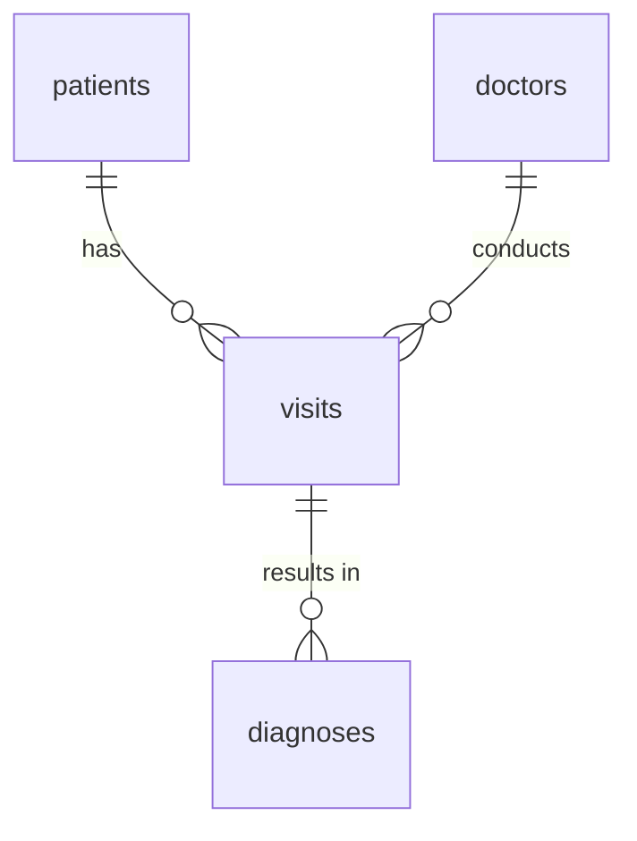

# 🎯 최종 프로젝트 브리핑: AI 기반 SQL 분석 에이전트 구축

> **배포 시점:** Day 1 · 8H  
> **최종 발표:** Day 4 · 24H (5–7분 라이브 데모)

---

## 프로젝트 개요

4일간 배운 기술을 통합하여, **자연어 질문 → SQL 생성 → 실행 → 검증 → 답변**을 자동으로 수행하는 **AI SQL 분석 에이전트**를 완성합니다.

단순 Text-to-SQL(1회 쿼리)이 아니라, **오류를 스스로 감지하고 재시도하는 에이전틱(Agentic) 분석 워크플로**가 목표입니다.

### 기술 스택 (고정)

| 영역 | 도구 |
|---|---|
| Database | PostgreSQL (Neon 무료 티어) |
| LLM | OpenAI API (gpt-4o-mini 권장) |
| Text-to-SQL | Vanna.ai (자가학습 루프) |
| RAG 프레임워크 | LlamaIndex · LangChain/LCEL |
| Vector DB | ChromaDB |
| 에이전트 | LangGraph (상태 기반 FSM) |
| 모니터링 | LangSmith (트레이싱) |
| 평가 | Ragas (정량 메트릭) |
| UI (선택) | Gradio |
| 실행 환경 | Google Colab |

---

## 제출 일정 (4단계 마일스톤)

| 단계 | 제출 시점 | 제출물 | 형식 |
|---|---|---|---|
| **과제 #1** | Day 2 시작 (9H) | 프로젝트 제안서 | 아래 양식에 따른 Markdown 문서 |
| **과제 #2** | Day 3 시작 (13H) | 스키마 + 시드 데이터 | Neon PostgreSQL에 배포 완료 + DSN 공유 |
| **과제 #3** | Day 4 시작 (21H) | 에이전트 v1 | Colab 노트북 + LangSmith trace URL (10개 질문) |
| **최종 발표** | Day 4 마지막 (24H) | 라이브 데모 + 발표 | 슬라이드 3장 + Ragas 리포트 |

---

## 과제 #1 — 프로젝트 제안서 양식

아래 구조를 따라 Markdown 문서로 작성하세요.

### 1. 도메인 및 활용 사례

- 선택한 도메인 (1–2문장)
- 대상 사용자와 분석 목적

> **팁:** 본인이 잘 아는 도메인을 선택하세요. 업무 지식이 풍부할수록 스키마 설계와 질문 작성이 수월합니다.

**도메인 예시:**
- 전자상거래 / 매출·물류 분석
- 인사·급여 관리 (HR Analytics)
- IoT 센서 데이터
- 학사·수강 관리
- 피트니스·건강 기록
- 게임 로그 분석

### 2. 데이터베이스 스키마

- **테이블 3~5개** (너무 많으면 관리 부담, 너무 적으면 질문 다양성 부족)
- 각 테이블의 컬럼 정의 (타입, PK, FK 명시)
- **`COMMENT ON COLUMN` 필수** — 모든 컬럼에 자연어 설명을 달아야 LLM이 스키마를 정확히 이해합니다

**스키마 작성 예시:**

```sql
CREATE TABLE patients (
    patient_id   SERIAL PRIMARY KEY,
    name         VARCHAR(100)  NOT NULL,
    birth_date   DATE          NOT NULL,
    gender       CHAR(1)       NOT NULL CHECK (gender IN ('M','F')),
    phone        VARCHAR(20),
    created_at   TIMESTAMP     DEFAULT now()
);

COMMENT ON COLUMN patients.patient_id IS '환자 고유 식별자 (자동 증가)';
COMMENT ON COLUMN patients.gender    IS '성별: M=남성, F=여성';
COMMENT ON COLUMN patients.phone     IS '연락처 (선택 입력)';
```

**ERD 다이어그램** — Mermaid 또는 dbdiagram.io로 간단히 작성:



### 3. 샘플 질문 (정확히 10개)

난이도별로 분포시켜 작성합니다.

| 난이도 | 개수 | SQL 요소 |
|---|---|---|
| **쉬움 (Easy)** | 3–4개 | `SELECT`, `WHERE`, `ORDER BY` |
| **보통 (Medium)** | 3–4개 | `GROUP BY`, `JOIN`, `CTE` |
| **어려움 (Hard)** | 2–3개 | 윈도우 함수, 다단계 추론, 서브쿼리 중첩 |

**작성 형식:**

```
[Easy] Q1: "2024년에 등록된 환자는 몇 명인가요?"
SQL:
  SELECT COUNT(*)
  FROM patients
  WHERE EXTRACT(YEAR FROM created_at) = 2024;
기대 결과: 단일 숫자 (예: 127)

[Medium] Q5: "진료과별 월 평균 방문 수를 보여주세요."
SQL:
  SELECT d.department, DATE_TRUNC('month', v.visit_date) AS month,
         COUNT(*) AS visit_count
  FROM visits v
  JOIN doctors d ON v.doctor_id = d.doctor_id
  GROUP BY d.department, month
  ORDER BY month, visit_count DESC;
기대 결과: 진료과 × 월 피벗 테이블

[Hard] Q9: "최근 3개월간 재방문율이 가장 높은 진료과 Top 3는?"
SQL:
  WITH recent AS ( ... ),
       revisits AS ( ... )
  SELECT department, revisit_rate
  FROM revisits
  ORDER BY revisit_rate DESC
  LIMIT 3;
기대 결과: 진료과명 + 재방문율(%) 3행
```

### 4. 데이터 샘플

주요 테이블별 **5–10행**의 예시 데이터를 포함합니다. 실제 시드 데이터의 축약 버전이면 됩니다.

---

## 과제 #2 — 스키마 + 시드 데이터 배포

### 요구사항

1. **Neon PostgreSQL** 인스턴스에 스키마 생성 완료
2. 테이블당 **최소 50행**의 시드 데이터 삽입
3. 모든 컬럼에 `COMMENT ON` 적용
4. FK 관계 정상 동작 확인
5. **DSN(접속 정보)을 강사에게 공유** (Colab 환경변수 설정용)

### 체크리스트

- [ ] 제안서의 스키마가 Neon에 그대로 반영되었는가?
- [ ] 시드 데이터가 10개 질문을 모두 답변할 수 있을 만큼 충분한가?
- [ ] `COMMENT ON`이 누락된 컬럼이 없는가?
- [ ] FK 제약 조건이 정상 작동하는가?

---

## 과제 #3 — 에이전트 v1

### 요구사항

1. **LangGraph 기반** 상태 머신 에이전트
   - 노드 구성: `generate_sql` → `run_sql` → `validate` → `answer`
   - 검증 실패 시 재생성 분기 (루프)
2. **LangSmith 트레이싱** 연결
   - 10개 질문 각각의 trace URL 기록
3. **보안 가드레일** 포함
   - `DELETE`, `DROP`, `UPDATE` 등 위험 SQL 차단
   - 허용 테이블 화이트리스트
   - 모든 `SELECT`에 `LIMIT 1000` 자동 부여
4. Colab 노트북 파일명: `<본인이름>_sql_agent.ipynb`

### 합격 기준

- 10개 질문 중 **7개 이상** 정답 또는 부분 정답

---

## 최종 발표 (Day 4 · 24H)

### 발표 구성 (5–7분)

**슬라이드 3장:**

1. **문제 정의** — 도메인, 분석 목적, 대상 사용자, 주요 질문 유형
2. **아키텍처** — LangGraph 상태 다이어그램, 데이터 흐름 (스키마 → 임베딩 → 검색 → SQL 생성 → 실행 → 답변), 사용 도구 선택 이유
3. **결과 및 회고** — Ragas 메트릭 (개선 전 vs 후), 성공 사례 2–3건, 실패 사례 1–2건 + 디버깅 과정, 배운 점

**라이브 데모 (필수):**
- 실시간으로 5–7개 질문 실행
- LangSmith trace 1–2건 시연 (에이전트 내부 추론 과정)
- 성공 사례 + 실패 사례 각 1건 설명

**Q&A:** 2분

### 발표 후 활동

- 수강생 상호 피드백
- 동료 투표: Best Agent / Best Insight / Best Presentation

---

## 평가 기준

### 프로젝트 배점 (전체 성적의 50%)

| 항목 | 비중 | 세부 기준 |
|---|---|---|
| **기능·동작** | 30% | 에이전트가 end-to-end로 동작하는가? 10개 질문 정답률. |
| **Ragas 정량 평가** | 25% | Faithfulness, Answer Relevancy, Context Precision/Recall |
| **LangGraph 설계** | 20% | 상태 설계, 루프/분기 관리, 에러 처리 |
| **최종 발표** | 15% | 발표 명확성, 데모 품질, 회고의 깊이 |
| **과제 성실도** | 10% | 3건의 과제를 기한 내 제출했는가? |

### 등급 기준

| 등급 | 조건 |
|---|---|
| **Pass (최소 기준)** | 제안서 제출 + Neon DB 구축 + 에이전트 실행(정확도 무관) + 발표 수행 |
| **Strong (75–85%)** | 7/10 정답, Faithfulness > 0.7, Answer Relevancy > 0.6, 깔끔한 LangGraph 설계 |
| **Excellent (90%+)** | 9/10 정답, Ragas 전 메트릭 > 0.8, 통찰력 있는 회고, 매끄러운 데모 |

### 전체 성적 구성

| 항목 | 비중 |
|---|---|
| 출석 | 20% |
| 실습 과제 (3건) | 30% |
| 최종 프로젝트 (데모 + 발표) | 50% |

---

## AI 가독성 스키마 설계 원칙 (Schema Intelligence)

프로젝트 성패의 핵심은 **LLM이 이해하기 쉬운 스키마**를 만드는 것입니다.

### 원칙 1: 명확한 네이밍

```
❌  p_id, v_dt, sal, dept_cd
✅  patient_id, visit_date, salary, department_code
```

### 원칙 2: 모든 컬럼에 COMMENT

```sql
COMMENT ON COLUMN visits.status IS
  '방문 결과: scheduled(예약) | completed(완료) | cancelled(취소) | no_show(미방문)';
```

### 원칙 3: FK를 명시적으로 선언

LLM은 FK 관계를 통해 JOIN 경로를 추론합니다. FK가 없으면 잘못된 JOIN을 생성할 확률이 높아집니다.

### 원칙 4: ENUM보다 룩업 테이블

```sql
-- ENUM 대신 → 별도 테이블로 분리하면 LLM이 값 목록을 직접 조회 가능
CREATE TABLE visit_status (
    code VARCHAR(20) PRIMARY KEY,
    label VARCHAR(50) NOT NULL
);
```

### 원칙 5: 적정 비정규화

JOIN 깊이가 3단계를 넘으면 리포팅 뷰(`vw_*`)를 만들어 LLM의 추론 부담을 줄이세요.

---

## 자주 묻는 질문 (FAQ)

**Q: 테이블을 몇 개까지 만들어야 하나요?**  
A: 3–5개가 적정입니다. 3개 미만이면 질문 다양성이 부족하고, 6개 이상이면 관리가 어렵습니다.

**Q: 시드 데이터는 실제 데이터여야 하나요?**  
A: 아닙니다. Faker 등으로 생성한 가상 데이터도 OK. 단, 질문에 대한 답이 나올 수 있을 만큼 현실적이어야 합니다.

**Q: gpt-4를 사용해도 되나요?**  
A: 네, 단 비용이 높으므로 gpt-4o-mini로 개발·테스트 후 최종 평가 시에만 gpt-4 사용을 권장합니다.

**Q: Gradio UI는 필수인가요?**  
A: 선택입니다. 발표 시 Colab 노트북에서 직접 실행해도 됩니다. 다만 Gradio를 붙이면 데모가 인상적입니다.

**Q: 팀 프로젝트도 가능한가요?**  
A: 개인 프로젝트입니다. 각자의 도메인과 스키마로 진행합니다.

---

## 제안서 작성 템플릿

아래를 복사하여 본인의 내용으로 채워 제출하세요.

```markdown
# [프로젝트 제목]

## 1. 도메인 및 활용 사례
[1–2문장으로 문제 상황과 대상 사용자를 기술]

## 2. 데이터베이스 스키마

### ERD
(Mermaid 또는 dbdiagram.io 링크)

### 테이블 정의
(CREATE TABLE + COMMENT ON 포함)

## 3. 샘플 질문 (10개)

### Easy (3–4개)
Q1: "..."
SQL: ...
기대 결과: ...

### Medium (3–4개)
Q5: "..."
SQL: ...
기대 결과: ...

### Hard (2–3개)
Q9: "..."
SQL: ...
기대 결과: ...

## 4. 데이터 샘플
(주요 테이블별 5–10행)
```

---

> **시작이 반이다.** 1H에서 봤던 완성 에이전트를 떠올리며, 4일 후에는 본인만의 에이전트를 만들어 발표하게 됩니다. 도메인 선정부터 시작하세요!
