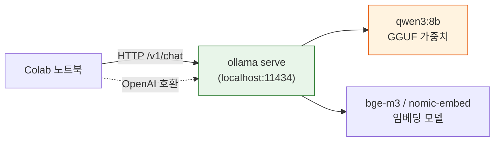

# 무료 LLM · Ollama (Qwen3) 실습 가이드

> **이 문서의 목적**
> OpenAI 유료 API 대신 **무료**로 강의 실습을 끝까지 따라갈 수 있도록 두 가지 대안 경로를 제공합니다.
> 강의 노트북 `00`~`19`의 LLM 호출 한두 줄만 바꾸면 동일한 실습이 그대로 동작합니다.

<div class="colab-link" data-notebook="99_free_llm_ollama"></div>

---

## 왜 이 가이드가 필요한가

OpenAI 무료 크레딧은 신규 가입자에게만 일부 제공되고, 강의가 진행될수록 **Day 3 Vanna 자가학습**·**Day 4 Ragas 평가** 단계에서 LLM 호출이 수십~수백 회로 늘어 **비용·rate limit 한계**에 부딪히기 쉽습니다.

본 가이드는 그 부담을 줄이기 위한 두 가지 경로를 제시합니다.

| 경로 | 핵심 도구 | 비용 | Colab 런타임 | 추천 상황 |
|---|---|---|---|---|
| **A. Ollama + Qwen3** | `ollama serve` + `qwen3:4b`/`qwen3:8b` | **완전 무료** (로컬 추론) | **GPU(T4 무료) 권장** | 강의 전 시간을 무료로 돌리고 싶을 때 |
| **B. Groq 무료 Tier** | OpenAI 호환 API + `qwen-qwq-32b`/`llama-3.3-70b-versatile` | **무료** (분당 토큰 한도) | CPU OK | GPU가 안 잡힐 때, 큰 모델이 필요할 때 |

!!! tip "권장 운영 방식"
    - **첫 학습용**: 경로 A (Ollama) — 실제로 어떻게 돌아가는지 체감.
    - **Day 3 Vanna·Day 4 Ragas 같은 호출량 많은 단계**: 경로 B (Groq) — 빠르고 토큰 한도가 큼.
    - **경로 A·B 모두 OpenAI 호환 API 형식**이라 노트북 코드 수정은 1~2줄로 끝납니다.

---

## 사전 준비 — 공통

### 1) Colab 런타임을 GPU로 (경로 A 전용)

Colab 상단 메뉴 **런타임 > 런타임 유형 변경 > 하드웨어 가속기 → T4 GPU**.

Qwen3 4B·8B 모델은 T4(16 GB)에서 충분히 돌아갑니다. CPU 런타임에서도 동작은 하지만 추론 속도가 매우 느려져 실습에 부적합합니다.

### 2) Colab Secrets — 선택 키 추가

`사전 준비` 페이지 표 위에 다음 두 키를 **추가**로 등록할 수 있습니다(필수 아님).

| 이름 | 값 | 사용 시점 |
|---|---|---|
| `GROQ_API_KEY` | Groq 콘솔에서 발급한 키(`gsk_...`) | 경로 B |
| `HF_TOKEN` | Hugging Face Read 토큰(`hf_...`) | 폴백/임베딩 다운로드 |

Groq Key 발급: `console.groq.com` 가입 → **API Keys** → **Create API Key** → 복사.

---

## 경로 A — Colab에서 Ollama로 Qwen3 띄우기

### 아키텍처



핵심: Ollama는 **OpenAI 호환 엔드포인트**(`http://localhost:11434/v1/chat/completions`)를 자동 노출합니다. 그래서 LlamaIndex·LangChain·Vanna 모두 **`base_url`과 `model`만 바꾸면** 그대로 작동합니다.

### 실습 Step 1 — Ollama 설치 + 백그라운드 실행

??? success "정답 보기"

    ```python
    # ============================================================
    # 1. Ollama 설치 (Colab 한 번만)
    # ============================================================
    !curl -fsSL https://ollama.com/install.sh | sh

    # ============================================================
    # 2. ollama serve 를 백그라운드로 띄우기
    #    - nohup + & 로 셀이 끝나도 살아 있게 함
    #    - 로그는 /content/ollama.log 에 적재
    # ============================================================
    import os, time, subprocess, requests

    subprocess.Popen(
        ["ollama", "serve"],
        stdout=open("/content/ollama.log", "w"),
        stderr=subprocess.STDOUT,
        env={**os.environ, "OLLAMA_HOST": "0.0.0.0:11434"},
    )

    # 서버가 뜰 때까지 최대 30초 대기
    for _ in range(30):
        try:
            requests.get("http://localhost:11434/api/tags", timeout=1)
            print("✅ ollama serve ready")
            break
        except Exception:
            time.sleep(1)
    else:
        raise RuntimeError("ollama serve 가 시작되지 않았습니다. /content/ollama.log 를 확인하세요.")
    ```

!!! warning "런타임을 끄면 모델이 사라집니다"
    Colab은 세션 종료 시 디스크가 초기화되므로, 다음 실습에서도 `ollama pull` 을 다시 해야 합니다. 절차를 자동화해 두세요.

### 실습 Step 2 — Qwen3 모델 받기

??? success "정답 보기"

    ```python
    # ============================================================
    # 3. Qwen3 모델 pull
    #    - qwen3:4b  : 기본 추천 (T4에서 8~15 tok/s, 약 3 GB)
    #    - qwen3:8b  : 더 똑똑함, T4에서도 동작 (약 5 GB, 4~8 tok/s)
    #    - bge-m3    : 다국어 임베딩 (약 1 GB)
    # ============================================================
    !ollama pull qwen3:4b
    !ollama pull bge-m3   # 임베딩까지 무료로 가고 싶을 때
    !ollama list
    ```

!!! tip "어떤 사이즈를 고를까"
    - **빠른 응답이 필요한 Gradio 챗봇·Day 2 멀티턴**: `qwen3:4b`
    - **Day 3 LangGraph 에이전트·Day 4 Ragas 채점**: `qwen3:8b` (정확도 차이 체감됨)
    - **메모리가 부족하면**: `qwen3:1.7b` (대신 SQL 정확도가 떨어짐)

### 실습 Step 3 — OpenAI 호환 클라이언트로 호출 테스트

??? success "정답 보기"

    ```python
    # ============================================================
    # 4. openai SDK 그대로 — base_url 만 ollama 로
    # ============================================================
    from openai import OpenAI

    llm = OpenAI(
        base_url="http://localhost:11434/v1",
        api_key="ollama",     # 아무 문자열이나 OK (Ollama 는 검증하지 않음)
    )

    resp = llm.chat.completions.create(
        model="qwen3:4b",
        messages=[
            {"role": "system", "content": "당신은 PostgreSQL SQL 전문가입니다."},
            {"role": "user", "content": "patients 테이블에서 남성 환자 수를 구하는 SQL을 알려줘. SQL만 응답."},
        ],
        temperature=0,
    )
    print(resp.choices[0].message.content)
    ```

!!! note "Qwen3의 thinking 모드"
    Qwen3는 기본적으로 `<think>...</think>` 블록으로 추론 과정을 노출합니다. SQL만 깔끔하게 받고 싶다면 시스템 프롬프트에 `Respond with the final answer only. Do not include reasoning.` 를 넣거나, `enable_thinking=False` 옵션이 있는 LangChain `ChatOllama` 를 쓰세요(아래 참조).

---

## 노트북별 LLM 교체 레시피

각 노트북의 **첫 번째 LLM 초기화 셀**만 아래 패턴으로 바꾸면 OpenAI ↔ Ollama ↔ Groq 를 자유롭게 전환할 수 있습니다.

### LlamaIndex (`04`·`05`·`06`·`08` 노트북)

```python
# ===== 기존 (OpenAI) =====
# from llama_index.llms.openai import OpenAI
# from llama_index.embeddings.openai import OpenAIEmbedding
# Settings.llm = OpenAI(model="gpt-4o-mini", temperature=0)
# Settings.embed_model = OpenAIEmbedding(model="text-embedding-3-small")

# ===== 교체 (Ollama / Qwen3) =====
from llama_index.llms.openai_like import OpenAILike
from llama_index.embeddings.ollama import OllamaEmbedding
from llama_index.core import Settings

Settings.llm = OpenAILike(
    model="qwen3:8b",
    api_base="http://localhost:11434/v1",
    api_key="ollama",
    is_chat_model=True,
    is_function_calling_model=False,   # 로컬 모델에선 끔
    temperature=0,
    request_timeout=180.0,
)
Settings.embed_model = OllamaEmbedding(
    model_name="bge-m3",
    base_url="http://localhost:11434",
)
```

설치 패키지 추가: `!pip install -q llama-index-llms-openai-like llama-index-embeddings-ollama`

### LangChain · LCEL (`12`·`13`·`14`·`15`·`16`·`17` 노트북)

```python
# ===== 기존 (OpenAI) =====
# from langchain_openai import ChatOpenAI, OpenAIEmbeddings
# llm = ChatOpenAI(model="gpt-4o-mini", temperature=0)
# embed = OpenAIEmbeddings(model="text-embedding-3-small")

# ===== 교체 (Ollama) =====
from langchain_ollama import ChatOllama, OllamaEmbeddings

llm = ChatOllama(
    model="qwen3:8b",
    temperature=0,
    base_url="http://localhost:11434",
    # Qwen3 thinking 비활성화 (SQL 결과만 받고 싶을 때)
    reasoning=False,
)
embed = OllamaEmbeddings(model="bge-m3", base_url="http://localhost:11434")
```

설치 패키지 추가: `!pip install -q langchain-ollama`

### Vanna.ai (`10`·`11` 노트북)

Vanna는 LLM 어댑터를 클래스 다중상속으로 합치는 패턴입니다. 이미 `vanna.ollama.Ollama` 어댑터가 내장되어 있어 OpenAI 자리에 그대로 끼우면 됩니다.

```python
# ===== 기존 (OpenAI + ChromaDB) =====
# from vanna.openai import OpenAI_Chat
# from vanna.chromadb import ChromaDB_VectorStore
# class MyVanna(ChromaDB_VectorStore, OpenAI_Chat): ...
# vn = MyVanna(config={"api_key": os.environ["OPENAI_API_KEY"], "model": "gpt-4o-mini"})

# ===== 교체 (Ollama + ChromaDB) =====
from vanna.ollama import Ollama
from vanna.chromadb import ChromaDB_VectorStore

class MyVanna(ChromaDB_VectorStore, Ollama):
    def __init__(self, config=None):
        ChromaDB_VectorStore.__init__(self, config=config)
        Ollama.__init__(self, config=config)

vn = MyVanna(config={
    "model": "qwen3:8b",
    "ollama_host": "http://localhost:11434",
})

# 이후 vn.connect_to_postgres(...), vn.train(ddl=...), vn.ask(...) 사용법은 동일
```

설치 패키지 추가: `!pip install -q "vanna[chromadb,ollama]"`

### LangGraph SQL 에이전트 (`17` 노트북)

`17_my_sql_agent.ipynb`의 `SQL 생성 노드`·`자연어 답변 노드`에서 사용하는 `ChatOpenAI` 인스턴스를 위 `ChatOllama` 로 그대로 치환하면 됩니다. 노드 시그니처(`{"messages": ..., "sql": ...}` 같은 state) 는 변경 없음.

!!! warning "Tool Calling이 필요한 ReAct 노드는 주의"
    Qwen3는 tool calling을 일부 지원하지만, 로컬 추론 안정성은 모델·양자화에 따라 들쭉날쭉합니다. **Day 3 19~20H의 ReAct/도구 호출 패턴**은 Groq 경로(아래) 또는 OpenAI를 권장합니다. 본 강의의 LangGraph 빌드는 **수동 노드 분기** 구조라 Ollama로도 끝까지 갑니다.

### Ragas 평가 (`19` 노트북)

```python
from ragas.llms import LangchainLLMWrapper
from ragas.embeddings import LangchainEmbeddingsWrapper
from langchain_ollama import ChatOllama, OllamaEmbeddings

evaluator_llm = LangchainLLMWrapper(ChatOllama(model="qwen3:8b", temperature=0))
evaluator_embed = LangchainEmbeddingsWrapper(OllamaEmbeddings(model="bge-m3"))

# 이후 evaluate(dataset, metrics=[...], llm=evaluator_llm, embeddings=evaluator_embed)
```

!!! tip "Ragas 채점에는 큰 모델이 유리"
    채점자(judge)가 약하면 메트릭 자체가 신뢰성을 잃습니다. 가능하면 `qwen3:8b` 또는 경로 B(Groq `qwen-qwq-32b`)로 채점하세요.

---

## 경로 B — Groq 무료 Tier (CPU·대용량 모델)

GPU 런타임이 잡히지 않거나 더 큰 모델이 필요할 때 쓰는 백업 경로입니다. Groq 는 OpenAI **호환 API**를 제공하므로 코드 변경은 사실상 두 줄입니다.

### 실습 Step — `openai` SDK 한 줄 치환

```python
import os
from openai import OpenAI

llm = OpenAI(
    api_key=os.environ["GROQ_API_KEY"],
    base_url="https://api.groq.com/openai/v1",
)

resp = llm.chat.completions.create(
    model="qwen-qwq-32b",   # 또는 "llama-3.3-70b-versatile"
    messages=[{"role": "user", "content": "SELECT * FROM patients LIMIT 1; 이 쿼리 무엇을 하나요?"}],
    temperature=0,
)
print(resp.choices[0].message.content)
```

LlamaIndex/LangChain은 위 LLM 교체 레시피에서 `api_base`/`base_url` 을 `https://api.groq.com/openai/v1` 로, `api_key`를 `GROQ_API_KEY`로 바꾸면 끝입니다.

!!! note "Groq의 무료 한도"
    2026년 5월 기준 무료 Developer Tier는 모델별로 분당 30 RPM, 일일 14,400 RPD 수준이라 강의 분량은 충분합니다. 정확한 한도는 `console.groq.com/settings/limits` 에서 확인하세요.

!!! warning "임베딩은 Groq에 없음"
    Groq는 LLM 추론 전용입니다. 임베딩은 다음 중 하나로 채우세요.

    - **로컬 sentence-transformers** (CPU OK):

      ```python
      from langchain_huggingface import HuggingFaceEmbeddings
      embed = HuggingFaceEmbeddings(model_name="BAAI/bge-m3")
      ```

    - **Ollama 임베딩 모델만 띄우기**: `ollama pull bge-m3` 후 위 LangChain `OllamaEmbeddings` 그대로.

---

## 어디까지 OpenAI 없이 끝낼 수 있나 — 단계별 매핑

| 노트북 | OpenAI 의존 | 대체 가능 여부 | 권장 경로 |
|---|---|---|---|
| `00_demo_agent` | LLM | ✅ 가능 | Ollama qwen3:8b |
| `01_postgres_basics` | 없음 | — | — |
| `02_sql_aggregation_join` | 없음 | — | — |
| `03_schema_intelligence` | LLM(스키마 코멘트 생성 시) | ✅ | Ollama qwen3:4b |
| `04_llamaindex_intro` | LLM + 임베딩 | ✅ | Ollama qwen3:4b + bge-m3 |
| `05_embedding_chromadb` | 임베딩 | ✅ | Ollama bge-m3 |
| `06_text_to_sql` | LLM | ✅ | Ollama qwen3:8b |
| `08_text_to_sql_advanced` | LLM | ✅ | Ollama qwen3:8b |
| `09_gradio_chatbot` | LLM | ✅ | Ollama qwen3:4b (응답 속도) |
| `10_vanna_intro` · `11_vanna_training` | LLM + 임베딩 | ✅ | Ollama qwen3:8b + bge-m3 |
| `12_langchain_lcel` ~ `16_langgraph_concept` | LLM | ✅ | Ollama qwen3:8b |
| `17_my_sql_agent` | LLM | ⚠️ 부분 | 수동 노드는 Ollama, ReAct 도구는 Groq 권장 |
| `18_langsmith_tracing` | (트레이서만) | ✅ | LLM 자체는 무엇이든 OK |
| `19_ragas_eval` | judge LLM + 임베딩 | ✅ | Groq qwen-qwq-32b 권장 |

!!! note "결론"
    수업 표준 경로는 OpenAI를 유지하되, **본인 프로젝트 호출량이 많아지는 Day 3·4 단계에서 Ollama·Groq로 전환**하는 것이 가장 안전합니다.

---

## 품질·속도 — 현실적인 기대치

(2026-04 검증, Colab T4 16 GB · 입력 600토큰 · 한국어 SQL 생성 기준)

| 모델 | 평균 응답 시간 | SQL 정확도(체감) | 비용 |
|---|---|---|---|
| `gpt-4o-mini` (OpenAI) | 1.5~3 s | ★★★★★ | 유료 |
| `qwen3:8b` (Ollama) | 6~12 s | ★★★★ | 무료 |
| `qwen3:4b` (Ollama) | 3~6 s | ★★★ | 무료 |
| `qwen-qwq-32b` (Groq) | 1~3 s | ★★★★★ | 무료(한도) |
| `llama-3.3-70b-versatile` (Groq) | 1~2 s | ★★★★ | 무료(한도) |

!!! tip "체감 팁"
    - **Day 1 Easy 질문**(단일 테이블, 집계만)은 `qwen3:4b`로도 거의 모두 통과.
    - **Day 2~3 Medium~Hard 질문**(다중 JOIN, CTE, 윈도우 함수)은 `qwen3:8b` 또는 Groq `qwen-qwq-32b`가 안정적.
    - 응답이 느리면 첫 셀에서 `temperature=0` + `top_p=0.9` 로 고정해 토큰 수를 줄이세요.

---

## 트러블슈팅

| 증상 | 원인 | 해결 |
|---|---|---|
| `ConnectionError: localhost:11434` | `ollama serve` 가 죽었거나 시작 중 | `!cat /content/ollama.log` 확인, Step 1 재실행 |
| `model not found` | `ollama pull` 미실행 또는 세션 재시작 | `!ollama list` 로 확인 후 재 pull |
| 응답이 `<think>...</think>` 로 시작 | Qwen3 thinking 모드 기본 ON | 시스템 프롬프트에 "Respond with final answer only" 명시 또는 `ChatOllama(reasoning=False)` |
| `CUDA out of memory` | T4 16 GB에 너무 큰 모델 | `qwen3:8b` → `qwen3:4b` 로 다운사이징, 다른 모델 `ollama rm` |
| Groq `Rate limit exceeded` | 분당 RPM 초과 | `time.sleep(2)` 삽입 또는 더 작은 배치 |
| Vanna `ask()` 가 SQL을 못 뽑음 | 학습 자산 부족 | `vn.train(ddl=...)`·`vn.train(documentation=...)` 보강 후 재시도 |
| LangChain tool calling 에러 | 로컬 모델의 도구 호출 한계 | Groq 경로로 전환 또는 ReAct 대신 수동 분기 |

---

!!! note "핵심 정리"
    - **경로 A (Ollama + Qwen3)**: 완전 무료, T4 GPU에서 강의 90% 커버. `localhost:11434/v1`을 OpenAI base_url로 그대로 사용.
    - **경로 B (Groq)**: CPU 런타임에서도 OK, OpenAI 호환 API + 큰 모델. 임베딩은 별도로.
    - **노트북 코드 수정**: LLM 초기화 셀 1~2줄 + 임베딩 1줄. 나머지 모든 코드는 동일.
    - **권장 운영**: Day 1·2는 OpenAI 또는 Ollama, 호출량 많아지는 Day 3·4는 Groq로 전환.
