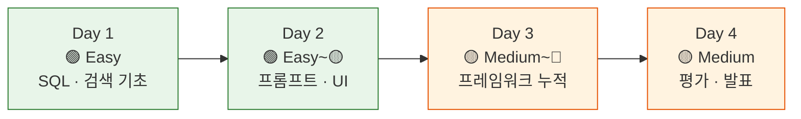
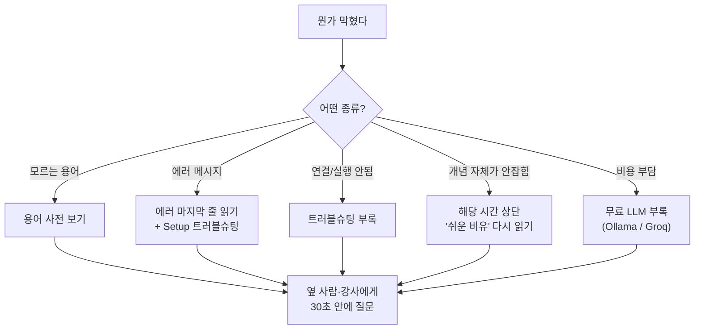

# 비개발자 학습 가이드 — "코딩이 처음입니다"

!!! tip "이 페이지는 언제 봐도 됩니다"
    강의 중 어느 시간이든, "지금 흐름을 따라가는 게 맞나?" 싶을 때 여기로 돌아오세요. 4일 내내 길잡이가 되는 페이지입니다.

이 강의는 **"AI에게 자연어로 질문하면 SQL을 짜서 답해주는 분석 에이전트"** 를 4일 동안 직접 만들어 보는 과정입니다. 코드를 쓴 적이 없거나, SQL을 처음 보거나, "엔진이 뭐예요?" 라는 질문이 부끄럽게 느껴진다면 — **이 페이지는 여러분을 위한 페이지** 입니다.

---

## 1. 결론부터 — 이렇게 따라오시면 됩니다

!!! success "비개발자가 24시간을 무사히 마치는 3가지 원칙"
    1. **코드를 한 줄씩 이해하려 하지 마세요.** 한 셀(코드 블록) 단위로 "이게 뭘 하려는 코드인지" 만 잡으면 충분합니다.
    2. **`▶` 버튼만 눌러도 절반은 성공입니다.** Colab 셀은 위에서 아래로 차례로 실행하면 동작하도록 설계되어 있습니다.
    3. **모르는 단어는 [용어 사전](appendix/glossary.md) 한 곳만 보세요.** 24H 전체에서 반복 등장하는 용어 50여 개를 비유와 함께 정리해 두었습니다.

---

## 2. 사전 지식 체크 — 정말 0부터 시작해도 되는가?

| 질문 | 답이 "예"라면 | 답이 "아니오"라면 |
|---|---|---|
| 웹 브라우저로 구글 검색을 할 수 있다 | ✅ 충분 | — |
| 엑셀에서 필터·정렬을 써본 적이 있다 | ✅ Day 1 SQL이 훨씬 친숙해집니다 | 괜찮습니다. 1시간이면 따라잡습니다 |
| Python·SQL 둘 다 처음이다 | ✅ 강의가 가정하는 출발점입니다 | 더 빠르게 진도를 빼실 수 있습니다 |
| 영어 약어(API·LLM·RAG)에 거부감이 있다 | 용어 사전을 옆에 띄워 두세요 | 그대로 진행 |

!!! note "정직한 한 줄"
    **개발자가 아니어도 24H 후 본인 도메인의 SQL 분석 에이전트를 만들 수 있습니다.** 단, "한 글자도 빠짐없이 다 이해해야 한다" 는 마음을 내려놓는 것만 필요합니다.

---

## 3. 처음 보는 화면·단어 빠른 적응법

### 3-1. Google Colab — "브라우저 안의 코딩 노트"

- **셀(cell)**: 화면의 회색 직사각형 칸. 왼쪽 ▶ 버튼을 누르면 그 칸의 코드가 실행됩니다.
- **마크다운 셀**: 글씨가 적힌 칸. 설명용이며 실행할 게 없습니다.
- **위에서 아래로 실행**: 노트북은 **반드시 첫 셀부터 순서대로** 실행해야 합니다. 중간 셀만 따로 실행하면 "이상한 변수 없음" 에러가 납니다.

### 3-2. 강의에서 가장 많이 등장하는 5단어

| 단어 | 한 줄 의미 | 비유 |
|---|---|---|
| **API** | 다른 회사 서비스를 코드로 부르는 창구 | 콜센터 전화번호 |
| **API Key** | 그 창구를 쓰기 위한 비밀번호 | 아파트 출입카드 |
| **패키지(라이브러리)** | 누가 이미 만든 코드 묶음 | 레고 키트 한 박스 |
| **`import`** | 그 키트를 이번 노트북에서 꺼내오기 | 책상 위에 박스 올려놓기 |
| **변수** | 값에 붙인 이름표 | 책장에 라벨 붙이기 |

→ 더 많은 단어는 [용어 사전](appendix/glossary.md) 으로.

### 3-3. 에러(빨간 글씨)가 떠도 괜찮습니다

비개발자 수강생이 가장 자주 만나는 에러 4종:

| 에러 화면에 보이는 단어 | 보통의 원인 | 해결 |
|---|---|---|
| `ModuleNotFoundError` | 패키지 설치를 안 했음 | 첫 셀의 `!pip install` 부터 다시 실행 |
| `NameError: ... not defined` | 위 셀을 안 돌렸음 | **위에서 아래로** 처음부터 다시 실행 |
| `OperationalError` / `ConnectionRefused` | DB 접속 실패 | Neon DSN 끝에 `?sslmode=require` 있는지 확인 |
| `AuthenticationError` | API Key 오류 | Colab 🔑 Secrets 토글이 켜져 있는지 확인 |

!!! tip "에러는 적이 아닙니다"
    빨간 글씨는 "잘못했다" 가 아니라 **"이 부분을 고치면 된다"** 를 알려주는 안내문입니다. 메시지의 마지막 줄을 그대로 ChatGPT/Claude에 붙여 넣으면 99%가 5분 안에 풀립니다.

---

## 4. 강의자료를 읽는 4가지 신호

각 시간 문서에 반복 등장하는 박스들은 다음과 같은 의미입니다.

| 박스 | 의미 | 비개발자라면 |
|---|---|---|
| `🎯 학습목표` | 이 시간이 끝나면 할 줄 알아야 하는 것 | 이 줄만 외워도 절반은 성공 |
| `!!! tip "쉬운 비유"` | 일상으로 푼 설명 | **반드시 읽고 시작** |
| `!!! note "핵심 정리"` | 이 시간의 결론 요약 | 마지막에 한 번 더 보기 |
| `!!! warning "복붙 금지"` 또는 `구경만 하세요` | 강사가 보여줄 시연용 | **이해 못 해도 100% 정상** |
| `!!! example "실습"` | 직접 손으로 해보는 미니 과제 | 답안은 보통 `??? success "정답 보기"` 클릭으로 펼쳐서 확인 |

!!! warning "이 신호를 만나면 마음을 내려놓으세요"
    `구경만 하세요`, `시연용`, `(심화)`, `4일 후에 직접 구현합니다` 라고 적힌 코드는 **지금 이해 못 해도 강의를 따라가는 데 전혀 지장이 없습니다.** 강사가 큰 그림을 보여주는 용도이니, 흐름만 잡고 넘어가세요.

---

## 5. Day별 난이도 신호등 — 미리 알아두기

### Day 1 (1~8H) 🟢 — "엑셀의 큰 형, 데이터베이스 길들이기"

- 가장 친숙한 구간입니다. 엑셀 비유가 거의 모든 개념에 적용됩니다.
- **목표**: PostgreSQL에 접속해서 `SELECT ... WHERE ... ORDER BY` 한 줄을 본인 손으로 칠 수 있게 되기.
- **헷갈려도 OK**: `EXPLAIN`, `JOIN` 의 내부 알고리즘.

### Day 2 (9~12H) 🟢🟡 — "AI에게 SQL을 시키기"

- 자연어 → SQL 변환을 시도합니다. 프롬프트(=AI에게 주는 지시문) 가 핵심.
- **목표**: 본인 프로젝트 DB에 대해 한국어 질문 3개를 AI가 SQL로 풀게 만들기.
- **헷갈려도 OK**: `NLSQLTableQueryEngine` 내부의 프롬프트 추적 로그 — "어떤 구조인지" 흐름만 보세요.

### Day 3 (13~20H) 🟡🔴 — "프레임워크가 누적되는 구간 — 가장 부담스러움"

- LangChain·LCEL·LangGraph 등 프레임워크 이름이 많이 나옵니다. 새 단어 폭격으로 느껴질 수 있습니다.
- **요령**: 한 시간에 1개의 도구만 익힌다는 마음으로. 모두 외우려 하지 말고, **"이 도구는 무슨 문제를 풀려고 만들어졌는가"** 만 잡으세요.
- **목표**: 19~20H에 이르러 **본인 프로젝트의 SQL 에이전트 v1** 을 가동.
- **헷갈려도 OK**: `Pydantic`, `TypedDict`, `function calling` 의 내부 동작 — "AI에게 양식을 채우게 시키는 도구" 정도로만 알아도 됩니다.

### Day 4 (21~24H) 🟡 — "평가하고 발표하기"

- 성능을 정량화(LangSmith·Ragas)하고 발표합니다. 새 코드는 적고 해석이 중요한 구간.
- **목표**: 본인 에이전트의 점수표를 만들어 5~7분 라이브 데모.
- **헷갈려도 OK**: Ragas 4개 메트릭의 수식 — 각 메트릭이 **어떤 종류의 실수를 잡아내는지** 만 이해하면 충분합니다.

---

## 6. 막혔을 때 — 5분 안에 해결하는 길

| 상황 | 어디로 | 링크 |
|---|---|---|
| 모르는 단어가 나왔다 | 용어 사전 | [appendix/glossary.md](appendix/glossary.md) |
| 빨간 에러가 떴다 | 트러블슈팅 부록 | [appendix/troubleshooting.md](appendix/troubleshooting.md) |
| 환경 설정이 꼬였다 | 사전 준비 페이지 | [setup.md](setup.md) |
| OpenAI 비용이 부담된다 | 무료 LLM 부록 | [appendix/free-llm-ollama.md](appendix/free-llm-ollama.md) |
| 프로젝트 진행 방향이 막막하다 | 프로젝트 브리프 | [appendix/project-brief.md](appendix/project-brief.md) |

---

## 7. 마음가짐 — "코드를 외우는 것이 목표가 아닙니다"

!!! quote "이 강의의 진짜 목표"
    24시간 후 여러분이 가져갈 것은 **"AI 에이전트가 어떻게 동작하는지에 대한 직관"** 과 **"필요할 때 어떤 도구를 꺼내야 하는지에 대한 지도"** 입니다.

    - 코드 한 줄 한 줄을 외우려 하지 마세요 — 검색 한 번이면 다시 찾을 수 있습니다.
    - 대신 **"이 시간에 푼 문제가 뭐였지?"** 를 매 시간 끝에 한 문장으로 적어 보세요.
    - 4일 동안 24개의 문장이 쌓이면, 그게 여러분의 머릿속 지도가 됩니다.

---

## 8. 다음 단계

1. **[사전 준비 페이지](setup.md)** 에서 환경을 셋업합니다 (30~40분 소요).
2. **[Day 1 시작하기](day1/index.md)** — 첫 시간은 `00_demo_agent.ipynb` 시연을 같이 구경하는 시간입니다.
3. **모르는 단어가 나오면 곧바로 [용어 사전](appendix/glossary.md) 으로** — 강의 중 가장 많이 다시 펼쳐 보게 될 페이지입니다.

!!! success "한 줄 격려"
    "내가 코드 한 줄 안 짠 사람인데 정말 따라갈 수 있을까?" — **네, 24H 후 본인이 만든 에이전트로 직접 발표하게 됩니다.** 천천히, 옆 사람·강사를 활용하며 따라오세요.
