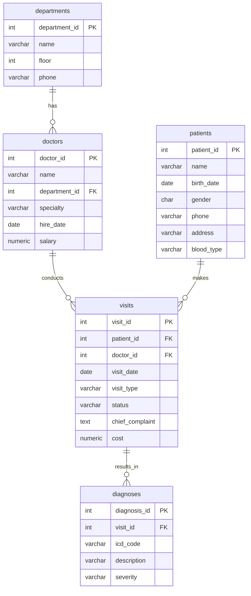

# 4H · Schema Intelligence — AI가 읽기 좋은 스키마

## 학습목표

- AI(LLM)이 스키마를 어떻게 읽는지 이해한다
- AI 가독성 스키마의 5가지 원칙을 적용할 수 있다
- 정규화 vs 비정규화 트레이드오프를 AI 관점에서 판단할 수 있다
- ERD를 Mermaid로 작성할 수 있다

!!! tip "🧭 이 시간을 이렇게 읽으세요 (비개발자용)"
    - **한 줄 핵심**: AI 가 SQL 을 정확히 만들게 하려면 **테이블·컬럼 이름과 주석부터 잘 짓는 것** 이 결정적이라는 사실을 체감하는 시간입니다.
    - **꼭 이해**: 약어(`p_id`)보다 풀어 쓴 이름(`patient_id`)이, 그리고 `COMMENT ON` 으로 단 컬럼 설명이 **AI 정답률을 직접 끌어올린다** 는 것. → 본인 프로젝트 스키마를 짤 때 그대로 적용합니다.
    - **지금은 몰라도 OK**: 1NF/2NF/3NF 같은 정규화 차수의 형식 정의. "정규화 = 같은 정보가 두 군데 안 적히게 하기" 정도의 직관이면 충분합니다.
    - **막히면**: [용어 사전 — 스키마/COMMENT ON/FK](../appendix/glossary.md#b-sqldb) 항목 참조.

---

<div class="colab-link" data-notebook="03_schema_intelligence"></div>

## 핵심 인사이트 — AI는 스키마를 "텍스트"로 읽는다

Text-to-SQL 시스템에서 LLM은 데이터베이스 스키마를 **프롬프트의 일부 텍스트**로 받습니다.
AI에게 SQL을 만들어달라고 하면, AI는 테이블 구조를 이렇게 전달받습니다:

### 나쁜 스키마 — AI가 추측해야 함

```sql
-- LLM에 전달되는 프롬프트 (나쁜 예)
-- AI: "p가 뭐지? nm이 이름인가? gen이 성별? bt는 뭘까..."

CREATE TABLE p (
    p_id INT PRIMARY KEY,
    nm VARCHAR(100),
    gen CHAR(1),
    bd DATE,
    bt VARCHAR(3)
);

-- 질문: "30대 여성 환자 수는?"
-- AI가 추측해야 할 것들:
--   p → patients? products?
--   nm → name?
--   gen → gender? generation?
--   bd → birth_date? bad_date?
--   bt → blood_type? batch?
```

### 좋은 스키마 — AI가 즉시 이해

```sql
-- LLM에 전달되는 프롬프트 (좋은 예)
-- AI: "patients 테이블, gender는 M/F, blood_type은 A/B/O/AB"

CREATE TABLE patients (
    patient_id   SERIAL PRIMARY KEY,
    name         VARCHAR(100) NOT NULL,
    gender       CHAR(1) NOT NULL CHECK (gender IN ('M','F')),
    birth_date   DATE NOT NULL,
    blood_type   VARCHAR(3) CHECK (blood_type IN ('A','B','O','AB'))
);

COMMENT ON TABLE patients IS '환자 기본 정보';
COMMENT ON COLUMN patients.gender IS '성별: M=남성, F=여성';
COMMENT ON COLUMN patients.blood_type IS '혈액형: A, B, O, AB';
```

!!! warning "추측이 많아질수록 오답 확률이 높아집니다"
    나쁜 스키마에서 LLM이 추측해야 하는 것:

    - `p`가 무슨 테이블인지
    - `nm`이 이름인지
    - `gen`이 성별인지, generation인지
    - `bt`가 혈액형인지, batch인지

    좋은 스키마에서는 추측할 것이 **0개**입니다. 이것이 곧 SQL 정확도의 차이입니다.

---

## 5가지 설계 원칙

| # | 원칙 | 나쁜 예 | 좋은 예 |
|---|---|---|---|
| 1 | **명시적 네이밍** | `p_id`, `nm`, `gen` | `patient_id`, `name`, `gender` |
| 2 | **COMMENT ON** | (설명 없음) | `COMMENT ON COLUMN gender IS '성별: M=남성'` |
| 3 | **FK 명시** | `pid INT` (무슨 테이블?) | `patient_id INT REFERENCES patients` |
| 4 | **ENUM -> 룩업 테이블** | `CHECK (status IN (...))` | 별도 status 테이블 |
| 5 | **리포팅 뷰** | 3단계 JOIN 필요 | `vw_visit_details` 뷰로 미리 결합 |

---

### 원칙 1: 명시적 네이밍

```
❌ 나쁜 예                    ✅ 좋은 예
─────────────────────────    ─────────────────────────
p_id                         patient_id
nm                           name
gen                          gender
v_dt                         visit_date
sal                          salary
dept_cd                      department_code
stat                         status
amt                          amount
```

!!! tip "네이밍 규칙"
    - 축약 금지 — 컬럼명만 보고 의미를 알 수 있어야 합니다
    - snake_case 사용 — `patientId`가 아닌 `patient_id`
    - FK 컬럼명은 참조 테이블의 PK명과 동일하게 — `visits.patient_id` = `patients.patient_id`
    - 불리언 컬럼은 `is_`, `has_` 접두어 — `is_active`, `has_insurance`

---

### 원칙 2: COMMENT ON — 모든 컬럼에 자연어 설명

PostgreSQL의 `COMMENT ON` 기능으로 테이블과 컬럼에 설명을 추가합니다.
이 설명이 LLM의 프롬프트에 포함되어 SQL 생성 정확도를 높입니다.

```sql
COMMENT ON TABLE patients IS '환자 기본 정보';
COMMENT ON COLUMN patients.gender IS '성별: M=남성, F=여성';
COMMENT ON COLUMN patients.blood_type IS '혈액형: A, B, O, AB';
COMMENT ON COLUMN visits.visit_type IS '진료 유형: outpatient=외래, inpatient=입원, emergency=응급';
COMMENT ON COLUMN visits.status IS '진료 상태: scheduled=예약, completed=완료, cancelled=취소, no_show=미방문';
```

#### COMMENT 전체 조회 코드

```python
# 테이블별 COMMENT 확인
from sqlalchemy import inspect

inspector = inspect(engine)

with engine.connect() as conn:
    result = conn.execute(text("""
        SELECT 
            c.table_name,
            c.column_name,
            pgd.description AS comment
        FROM information_schema.columns c
        JOIN pg_catalog.pg_class cls
            ON cls.relname = c.table_name
        JOIN pg_catalog.pg_namespace ns
            ON ns.oid = cls.relnamespace AND ns.nspname = c.table_schema
        LEFT JOIN pg_catalog.pg_attribute a
            ON a.attrelid = cls.oid AND a.attname = c.column_name
        LEFT JOIN pg_catalog.pg_description pgd
            ON pgd.objoid = cls.oid
            AND pgd.objsubid = a.attnum
        WHERE c.table_schema = 'public'
        ORDER BY c.table_name, c.ordinal_position
    """))
    
    current_table = ""
    for row in result:
        if row[0] != current_table:
            current_table = row[0]
            print(f"\n📋 {current_table}")
        comment = row[2] or "(COMMENT 없음)"
        print(f"  {row[1]}: {comment}")
```

---

### 원칙 3: FK 명시적 선언

```sql
-- ❌ FK 없이 → LLM이 JOIN 경로를 추론할 수 없음
CREATE TABLE visits (
    visit_id INT PRIMARY KEY,
    pid INT,          -- 어떤 테이블의 어떤 컬럼?
    did INT           -- doctor_id인지 department_id인지?
);

-- ✅ FK 명시 → LLM이 자동으로 JOIN 경로를 파악
CREATE TABLE visits (
    visit_id    INT PRIMARY KEY,
    patient_id  INT NOT NULL REFERENCES patients(patient_id),
    doctor_id   INT NOT NULL REFERENCES doctors(doctor_id)
);
```

!!! tip "FK가 있으면 LLM이 자동으로 아는 것들"
    - `visits.patient_id` → `patients` 테이블과 JOIN 가능
    - `visits.doctor_id` → `doctors` 테이블과 JOIN 가능
    - JOIN 조건: `ON visits.patient_id = patients.patient_id`

    FK 없이 `pid INT`만 있으면 LLM은 이 정보를 추측해야 합니다.

---

### 원칙 4: ENUM보다 룩업 테이블

```sql
-- ❌ CHECK 제약 → LLM이 허용된 값을 알려면 DDL을 정독해야 함
CREATE TABLE visits (
    status VARCHAR(20) CHECK (status IN ('scheduled','completed','cancelled','no_show'))
);

-- ✅ 룩업 테이블 → LLM이 SELECT로 값 목록을 직접 조회 가능
CREATE TABLE visit_status (
    code    VARCHAR(20) PRIMARY KEY,
    label   VARCHAR(50) NOT NULL,
    description TEXT
);
INSERT INTO visit_status VALUES
('scheduled',  '예약',   '진료 예약 상태'),
('completed',  '완료',   '진료 완료'),
('cancelled',  '취소',   '환자 또는 병원에 의해 취소'),
('no_show',    '미방문', '예약했으나 방문하지 않음');
```

!!! note "핵심 정리"
    룩업 테이블의 장점:

    - LLM이 `SELECT * FROM visit_status`로 허용 값을 조회 가능
    - 한국어 `label`이 있어 LLM이 의미를 정확히 파악
    - 값 추가/변경 시 DDL 수정 불필요 (INSERT만 하면 됨)
    - `description`으로 비즈니스 맥락까지 전달

---

### 원칙 5: 리포팅 뷰 — 미리 JOIN해둔 테이블

JOIN 깊이가 3단계 이상이면 LLM이 실수할 확률이 높아집니다.
리포팅 뷰로 "미리 JOIN해둔 테이블"을 제공하면 AI의 SQL 정확도가 크게 올라갑니다.

#### vw_visit_details 뷰 생성

```python
with engine.begin() as conn:
    conn.execute(text("""
        CREATE OR REPLACE VIEW vw_visit_details AS
        SELECT
            v.visit_id,
            v.visit_date,
            v.visit_type,
            v.status,
            v.chief_complaint,
            v.cost,
            p.name          AS patient_name,
            p.gender        AS patient_gender,
            EXTRACT(YEAR FROM AGE(p.birth_date)) AS patient_age,
            d.name          AS doctor_name,
            d.specialty     AS doctor_specialty,
            dept.name       AS department_name
        FROM visits v
        JOIN patients p    ON p.patient_id = v.patient_id
        JOIN doctors d     ON d.doctor_id = v.doctor_id
        JOIN departments dept ON dept.department_id = d.department_id
    """))
print("✅ vw_visit_details 뷰 생성 완료!")
```

```sql
COMMENT ON VIEW vw_visit_details IS '진료 상세 정보 (환자/의사/진료과 JOIN 완료)';
```

#### 뷰 활용 — JOIN 없이 간단 조회

```python
# 뷰를 사용하면 복잡한 JOIN 없이 간단히 조회
run_query("""
    SELECT patient_name, doctor_name, department_name, visit_date, cost
    FROM vw_visit_details
    WHERE status = 'completed'
    ORDER BY visit_date DESC
    LIMIT 10
""", "뷰를 활용한 간편 조회")
```

!!! tip "뷰 사용의 효과"
    **뷰 없이**: AI가 4개 테이블(visits, patients, doctors, departments)을 JOIN해야 함
    → JOIN 조건 실수 확률 높음

    **뷰 사용**: AI가 `vw_visit_details` 1개 테이블만 조회
    → `SELECT ... FROM vw_visit_details WHERE ...` 한 줄로 끝

---

## 정규화 vs 비정규화 트레이드오프

| 항목 | 정규화 (Normalized) | 비정규화 (Denormalized) |
|---|---|---|
| 데이터 무결성 | ✅ 높음 | ❌ 중복 가능 |
| 업데이트 일관성 | ✅ 한 곳만 수정 | ❌ 여러 곳 수정 |
| 저장 공간 | ✅ 효율적 | ❌ 중복으로 비효율 |
| 쿼리 복잡도 | ❌ JOIN 많음 | ✅ 단순 |
| LLM 이해도 | ❌ JOIN 실수 | ✅ 즉시 이해 |
| 추천 활용 | 원본 데이터 저장 | 리포팅/분석 |

!!! tip "AI 관점 권장 전략"
    **원본은 정규화 유지** + **리포팅 뷰(`vw_*`)로 비정규화 제공**

    이렇게 하면:

    - 데이터 무결성은 정규화로 보장
    - AI의 SQL 생성 정확도는 뷰로 보장
    - 두 마리 토끼를 잡을 수 있습니다

---

## ERD (Entity-Relationship Diagram) — Mermaid 문법

병원 DB의 전체 관계를 Mermaid ERD로 표현합니다.



!!! tip "Mermaid ERD 읽는 법"
    - `||--o{` : 1:N 관계 (하나의 진료과에 여러 의사)
    - `PK` : Primary Key
    - `FK` : Foreign Key
    - `mermaid.live`에 접속하면 위 코드를 붙여넣어 ERD 이미지를 만들 수 있습니다

---

## 실습

!!! example "실습 — COMMENT 완성도 검사"
    병원 DB의 모든 컬럼에 COMMENT가 달려 있는지 검사하세요.

    _힌트: `information_schema.columns`와 `pg_catalog.pg_description`을 LEFT JOIN하고, `pgd.description IS NULL`인 컬럼을 'COMMENT 없음'으로 표시하세요. JOIN 키는 `pg_class.oid`(테이블)와 `pg_attribute.attnum`(컬럼)입니다._

    COMMENT가 빠진 컬럼이 있다면 `COMMENT ON COLUMN ...`으로 추가해보세요.

!!! example "실습 — vw_visit_details로 조회"
    `vw_visit_details` 뷰를 사용하여 "2026년 내과 외래 진료 건수"를 조회하세요.

    _힌트: `vw_visit_details`에서 `EXTRACT(YEAR FROM visit_date) = 2026`, `department_name = '내과'`, `visit_type = 'outpatient'`, `status = 'completed'` 조건으로 `COUNT(*)`를 집계하세요._

    뷰 없이 같은 결과를 얻으려면 4개 테이블을 JOIN해야 합니다.
    뷰를 사용하면 쿼리가 얼마나 단순해지는지 체감해보세요.

!!! example "실습 — ERD 초안 작성"
    본인 프로젝트 도메인을 떠올리며 ERD 초안(3테이블 이상)을 Mermaid로 작성하세요.
    `mermaid.live`에서 결과를 확인해보세요.

!!! question "생각해보기"
    본인 프로젝트 도메인에서 리포팅 뷰가 필요한 경우는 어떤 것이 있을까요?

    예시:

    - 이커머스: 주문 + 상품 + 고객 + 배송을 합친 `vw_order_details`
    - 학교: 학생 + 수업 + 성적 + 교수를 합친 `vw_grade_details`
    - 인사: 직원 + 부서 + 급여 + 평가를 합친 `vw_employee_summary`

    본인 도메인에서 자주 함께 조회되는 테이블 조합을 찾아보세요.
    이것이 8H 프로젝트 제안서의 기초가 됩니다.

---

## 핵심 정리

!!! note "핵심 정리"
    - AI는 스키마를 **텍스트**로 읽으므로, **명시적 네이밍 + COMMENT ON**이 핵심
    - **FK 명시**: LLM이 JOIN 경로를 자동으로 파악
    - **룩업 테이블**: LLM이 허용 값을 SELECT로 조회 가능
    - **리포팅 뷰**: 복잡한 JOIN을 미리 해두면 AI의 SQL 정확도가 올라감
    - **전략**: 원본은 정규화 + 리포팅 뷰로 비정규화 제공
    - 프로젝트에서도 이 5원칙을 반드시 적용할 것
