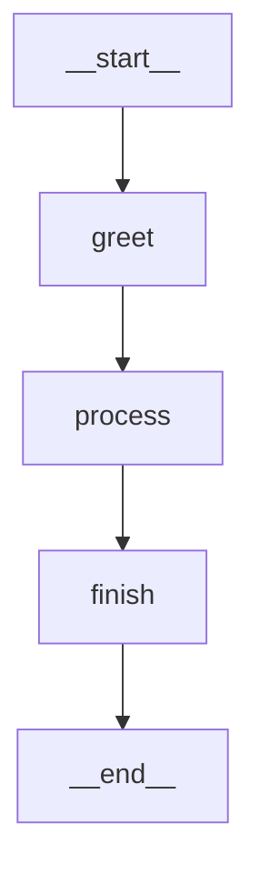
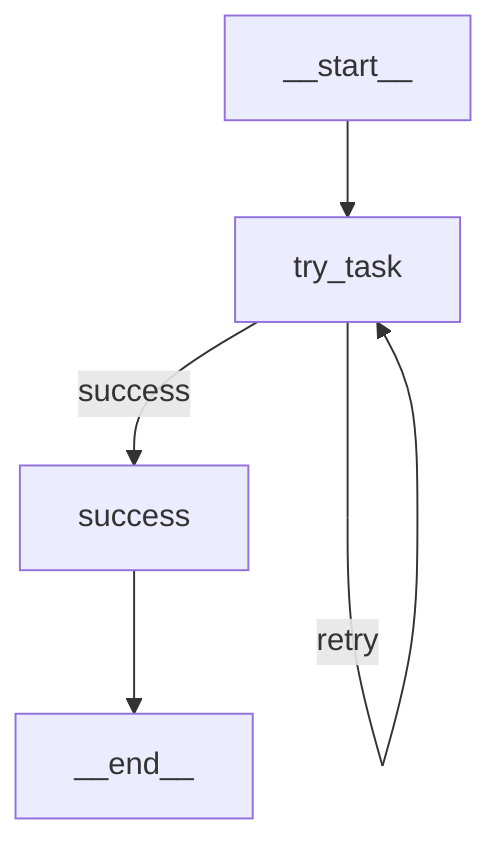

# 19H -- LangGraph 개념

## 학습목표

- LCEL 체인의 한계(DAG만 가능)를 이해하고 LangGraph의 필요성을 설명할 수 있다
- `StateGraph`, `Node`, `Edge`, `ConditionalEdge`로 그래프를 구성할 수 있다
- 루프와 재시도 패턴을 구현할 수 있다

!!! tip "🧭 이 시간을 이렇게 읽으세요 (비개발자용)"
    - **한 줄 핵심**: LCEL 로 못 그리는 **루프·재시도·조건 분기** 를 그릴 수 있는 그래프 도구.
    - **꼭 이해**: LangGraph = "신호등 시뮬레이터". State + Node + Edge + 조건 분기 4가지 부품으로 흐름도를 그립니다.
    - **지금은 몰라도 OK**: Checkpointer, ReAct 패턴의 내부, 멀티 세션 관리. 본인 프로젝트 v1 에는 단순 그래프면 충분.
    - **막히면**: 모르는 단어는 [용어 사전](../appendix/glossary.md) 으로 → 처음이라면 [비개발자 학습 가이드](../beginners-guide.md).

---

<div class="colab-link" data-notebook="16_langgraph_concept"></div>

## LCEL 한계 -> LangGraph 필요성

```
LCEL 체인 (DAG -- 한 방향):
  A --> B --> C --> D
  ❌ B에서 실패하면? --> 되돌아갈 수 없음
  ❌ 조건에 따라 C를 건너뛰려면? --> 복잡한 분기 불가

LangGraph (FSM -- 상태 머신):
  A --> B --> C --> D
       ^          |
       +----------+  <-- 실패 시 B로 되돌아가서 재시도
  ✅ 루프, 조건부 분기, 재시도 모두 가능
```

### LCEL vs LangGraph 비교

| 특성 | LCEL 체인 | LangGraph |
|---|---|---|
| **구조** | DAG (방향 비순환 그래프) | FSM (유한 상태 머신) |
| **데이터 흐름** | 한 방향으로만 진행 | 루프, 분기, 되돌아가기 가능 |
| **에러 처리** | fallback (대체 모델) | 재시도 루프, 조건부 분기 |
| **상태 관리** | 입력 -> 출력 파이프 | 공유 상태(State) 읽기/쓰기 |
| **복잡도** | 단순 (파이프 연산자) | 중간 (그래프 구조) |
| **적합한 경우** | 단순 체인 (RAG, 변환) | 에이전트, 멀티스텝, 재시도 |
| **사용 예시** | prompt \| model \| parser | SQL 에이전트, ReAct 에이전트 |

!!! tip "LangGraph를 한 줄로 설명하면"
    **LangGraph = "상태(State)를 중심으로 동작하는 그래프 실행 엔진"**
    LCEL이 "파이프라인"이라면, LangGraph는 "상태 머신"입니다.

!!! note "'상태 머신(FSM)' 이 낯설다면 — 신호등 비유"
    - **상태(state)** = "지금 신호등이 어떤 색인지" (빨강·노랑·초록).
    - **전이(edge)** = "어떤 조건일 때 다음 색으로 바뀌는지" (타이머가 끝나면, 센서가 차를 감지하면 …).
    - **유한 상태 머신(FSM)** = 가능한 상태가 **정해진 개수** 뿐이고, 각 상태에서 다음 상태로 가는 규칙이 명확하게 정의된 기계.

    우리 에이전트도 똑같습니다. "질문 받음 → SQL 생성 → 실행 → 성공이면 답변, 실패면 다시 SQL 생성" 이라는 **몇 가지 안 되는 상태** 사이를 왔다 갔다 합니다. LangGraph 는 이 신호등 그림을 코드로 그리는 도구라고 생각하세요.

---

## LangGraph 핵심 개념

```
StateGraph      -- 상태(State)를 중심으로 동작하는 그래프
State           -- TypedDict로 정의. 모든 노드가 읽고 쓰는 공유 데이터.
Node            -- 상태를 변환하는 함수. (State -> partial State)
Edge            -- 노드 간 연결 (무조건 이동)
ConditionalEdge -- 조건에 따라 다른 노드로 분기
EntryPoint      -- 그래프 시작점
END             -- 그래프 종료
```

---

## 최소 LangGraph 예제

```python
# ============================================================
# 1. 최소 LangGraph 예제
# ============================================================
!pip install -q langgraph

from typing import TypedDict
from langgraph.graph import StateGraph, END

# 상태 정의
class SimpleState(TypedDict):
    message: str
    step: int

# 노드 함수들
def greet(state: SimpleState) -> dict:
    return {"message": f"안녕하세요! (step={state['step']})", "step": state["step"] + 1}

def process(state: SimpleState) -> dict:
    return {"message": state["message"] + " --> 처리 완료!", "step": state["step"] + 1}

def finish(state: SimpleState) -> dict:
    return {"message": state["message"] + " --> 종료.", "step": state["step"] + 1}

# 그래프 조립
graph = StateGraph(SimpleState)
graph.add_node("greet", greet)
graph.add_node("process", process)
graph.add_node("finish", finish)

graph.set_entry_point("greet")
graph.add_edge("greet", "process")
graph.add_edge("process", "finish")
graph.add_edge("finish", END)

app = graph.compile()

# 실행
result = app.invoke({"message": "", "step": 0})
print(f"최종 메시지: {result['message']}")
print(f"총 스텝: {result['step']}")
```

!!! note "핵심 정리"
    - **State(상태)**: 모든 노드가 공유하는 데이터. `TypedDict`로 정의.
    - **Node(노드)**: `State`를 받아서 **변경할 부분만** 반환하는 함수.
    - **Edge(엣지)**: 노드 간 연결. `add_edge("A", "B")`는 "A 다음에 B"를 의미.
    - `set_entry_point("greet")`: 그래프 시작 노드.
    - `END`: 그래프 종료 마커.

---

## 그래프 시각화

```python
# ============================================================
# 2. 그래프 시각화
# ============================================================
from IPython.display import Image, display

try:
    display(Image(app.get_graph().draw_mermaid_png()))
except Exception:
    print(app.get_graph().draw_mermaid())
```

Mermaid 다이어그램으로도 확인할 수 있습니다:



---

## 조건부 분기 + 루프 (재시도 패턴)

20H SQL 에이전트에서 핵심적으로 사용되는 **재시도 패턴**입니다. 작업이 실패하면 다시 시도합니다.

```python
# ============================================================
# 3. 조건부 분기 + 루프
# ============================================================
import random

class RetryState(TypedDict):
    task: str
    result: str
    error: str
    attempts: int

def try_task(state: RetryState) -> dict:
    """작업 시도 (30% 확률로 실패)"""
    state_attempts = state.get("attempts", 0) + 1
    if random.random() < 0.3 and state_attempts <= 3:
        return {
            "error": f"시도 {state_attempts}에서 랜덤 에러 발생!",
            "attempts": state_attempts,
        }
    return {
        "result": f"✅ 시도 {state_attempts}에서 성공!",
        "error": "",
        "attempts": state_attempts,
    }

def handle_success(state: RetryState) -> dict:
    return {"result": state["result"] + " --> 완료 처리됨."}

def should_retry(state: RetryState) -> str:
    """재시도 여부 판단"""
    if not state.get("error"):
        return "success"
    if state.get("attempts", 0) >= 3:
        return "success"  # 최대 시도 초과 --> 강제 종료
    return "retry"

# 그래프 조립
retry_graph = StateGraph(RetryState)
retry_graph.add_node("try_task", try_task)
retry_graph.add_node("success", handle_success)

retry_graph.set_entry_point("try_task")
retry_graph.add_conditional_edges(
    "try_task",
    should_retry,
    {"success": "success", "retry": "try_task"},  # retry --> 다시 try_task로!
)
retry_graph.add_edge("success", END)

retry_app = retry_graph.compile()

# 실행 (여러 번 해보면 재시도 횟수가 다름)
for i in range(3):
    result = retry_app.invoke({"task": "데이터 처리", "result": "", "error": "", "attempts": 0})
    print(f"[실행 {i+1}] 시도 {result['attempts']}회: {result['result']}")
```

!!! warning "add_conditional_edges 주의"
    `should_retry` 함수의 반환값(`"success"`, `"retry"`)과
    매핑 딕셔너리의 키(`{"success": "success", "retry": "try_task"}`)가 **정확히 일치**해야 합니다.
    불일치 시 런타임 에러가 발생합니다.

### 재시도 그래프 시각화

```python
# 그래프 시각화
try:
    display(Image(retry_app.get_graph().draw_mermaid_png()))
except:
    print(retry_app.get_graph().draw_mermaid())
```



---

## 실행 추적 -- stream()

`stream()`을 사용하면 각 노드의 실행 과정을 단계별로 추적할 수 있습니다. 디버깅에 매우 유용합니다.

```python
# ============================================================
# 4. 실행 추적 -- 어떤 노드를 거쳤는지 확인
# ============================================================

# stream으로 각 노드의 실행 과정을 추적
print("🔍 실행 추적:")
for event in retry_app.stream({"task": "추적 테스트", "result": "", "error": "", "attempts": 0}):
    for node_name, node_output in event.items():
        print(f"  📍 {node_name}: attempts={node_output.get('attempts', '?')}, "
              f"error='{node_output.get('error', '')[:30]}', "
              f"result='{node_output.get('result', '')[:30]}'")
```

!!! tip "stream() vs invoke()"
    - `invoke()`: 최종 결과만 반환. 중간 과정을 볼 수 없음.
    - `stream()`: 각 노드가 실행될 때마다 이벤트를 발생. 디버깅에 유용.
    - 20H SQL 에이전트에서 `stream()`으로 "SQL 생성 -> 실행 -> 검증 -> 답변" 과정을 추적합니다.

---

## 노드 추가 실습 -- 로깅 기능 구현

!!! example "실습 -- 노드 추가하여 로깅 기능 구현"
    기존 그래프에 `log` 노드를 추가하여 모든 작업을 기록합니다.

    `SimpleState` 를 확장한 `LogState`(`message: str`, `step: int`, `log: list`) 를 정의하고, 다음 4개 노드로 그래프를 조립하세요.

    - `greet` → `process` → `log` → `finish` → `END`
    - 각 노드는 자신이 한 일을 `log` 리스트에 append (예: `[greet] ...`).
    - `log` 노드는 누적된 로그 전체를 `print` 로 출력.

    실행 후 `result['message']`, `result['step']`, `result['log']` 를 모두 출력하여 노드들이 순서대로 실행되었는지 확인하세요.

    *힌트: 노드 함수는 변경할 키만 dict 로 반환하면 됩니다. 누적 로그는 `state.get("log", []) + ["[노드명] ..."]` 패턴을 사용하세요. `log` 키 초기값을 빈 리스트로 명시해 `invoke({"message": "", "step": 0, "log": []})` 로 시작합니다.*

---

## (심화) Checkpointer -- 멀티턴·재시작 대응

지금까지의 예제는 `agent.invoke({...})`가 끝나면 **상태가 증발**합니다. 다음 턴에서 이전 히스토리를 이어가려면 LangGraph의 **Checkpointer**를 붙여야 합니다. 자세한 구현은 본 강의 범위를 벗어나지만, 본인 프로젝트 v2·v3에서 "대화 재개"가 필요하다면 다음 API를 참고하세요.

```python
# (참고 예시 -- 실습 범위 아님)
from langgraph.checkpoint.memory import MemorySaver

checkpointer = MemorySaver()
agent = graph.compile(checkpointer=checkpointer)

# thread_id로 대화 세션 구분
config = {"configurable": {"thread_id": "user-42"}}
agent.invoke({"question": "내과 의사 목록"}, config=config)
agent.invoke({"question": "그 중 급여 최고는?"}, config=config)
# → 두 번째 invoke에서 이전 상태 자동 복구
```

!!! tip "Checkpointer가 필요한 순간"
    - **Gradio 다중 세션** -- 22H Gradio UI의 `ChatState`를 대체할 수 있습니다.
    - **LangSmith에서 중단된 실행을 이어서 재생** -- 재시도 경로를 DB에 기록.
    - **프로덕션 멀티턴 챗봇** -- 서버 재시작에도 대화 이력 보존.

    수업 시간에는 inmemory `MemorySaver`로 시연하되, 프로덕션에서는 `PostgresSaver`(langgraph-checkpoint-postgres) 또는 Redis 기반을 권장합니다.

---

## 실습 과제

1. `SimpleState` 그래프에 새로운 노드를 추가하고 실행하세요.
2. `RetryState` 그래프의 최대 재시도 횟수를 5로 변경하고 테스트하세요.
3. `stream()`으로 재시도 그래프의 실행 과정을 추적하세요.

!!! question "생각해보기"
    - 재시도 루프에서 최대 시도 횟수를 제한하지 않으면 어떻게 되나요?
    - LCEL 체인으로 재시도 패턴을 구현할 수 있나요? 어떤 한계가 있나요?
    - `conditional_edges`에서 3가지 이상의 분기를 만들 수 있나요?

---

!!! note "핵심 정리"
    - **LangGraph** = LCEL의 확장. 루프, 조건 분기, 재시도 지원
    - **StateGraph**: 상태(TypedDict) + 노드(함수) + 엣지(연결)
    - **add_conditional_edges**: 조건에 따라 다른 노드로 분기 (반환값 = 노드 이름 문자열)
    - **stream()**: 각 노드의 실행 과정을 단계별로 추적 (디버깅에 필수)
    - 20H에서 이 패턴을 사용하여 **SQL 에이전트**를 구축합니다

---

!!! warning "🆘 비개발자를 위한 회복 가이드 — 여기까지 어렵다면"
    1. **상태 머신(FSM)** 은 신호등입니다. "지금 무슨 색인지 + 다음 색은 무엇인지" — 그 이상의 수학은 필요 없습니다.
    2. `StateGraph + Node + Edge` = "그림(흐름도)을 코드로 그리기". `add_node` 로 동그라미 하나, `add_edge` 로 화살표 하나.
    3. **조건부 분기(`add_conditional_edges`)** 는 "성공이면 다음 단계, 실패면 되돌아가기" 한 패턴만 외워도 20H SQL 에이전트에서 그대로 씁니다.

    → 더 막힌다면 [용어 사전 — LangGraph 섹션](../appendix/glossary.md#e-langchain-lcel-pydantic-langgraph) 으로.
