# 24H · 최종 발표 & 수료

!!! tip "🧭 이 시간을 이렇게 읽으세요 (비개발자용)"
    - **한 줄 핵심**: 본인 에이전트를 5~7분 안에 시연하고 동료들과 상호 피드백한 뒤 수료합니다.
    - **꼭 이해**: 발표 구성 — (1) 도메인·문제 1분, (2) 아키텍처 다이어그램 1분, (3) 라이브 데모 2~3분, (4) Ragas 결과·회고 1~2분.
    - **지금은 몰라도 OK**: 라이브 데모가 실패하면? **사전 녹화한 화면 + 캡처** 백업이 있으면 충분합니다. 침착하게 회고 부분에서 만회.
    - **막히면**: 모르는 단어는 [용어 사전](../appendix/glossary.md) 으로 → 처음이라면 [비개발자 학습 가이드](../beginners-guide.md).

## 발표 규칙

### 해야 할 것

- 라이브 데모 최소 **2개 질문** 실행
- Ragas 점수 또는 **Before/After** 공유
- **실패 사례 1건** 이상 설명 (디버깅 포함)
- **7분 이내**에 마무리

### 하지 말 것

- 코드를 줄 단위로 설명 (아키텍처 **흐름만** 전달)
- 시간 초과 (타이머 경고 후 1분 내 종료)
- 다른 발표 중 대화/작업

!!! tip "발표 직전 체크리스트"
    발표 순서가 오기 전에 빠르게 확인하세요:

    - [ ] Colab 런타임이 살아있는가?
    - [ ] 데모할 질문 3개를 미리 복사해두었는가?
    - [ ] 백업 스크린샷이 발표 파일에 포함되어 있는가?
    - [ ] 발표 슬라이드가 전체 화면으로 보이는가?

---

## 평가 기준

| 항목 | 배점 | 기준 |
|---|---|---|
| **에이전트 동작** | 30점 | 라이브 데모 성공 여부 (실패 시 디버깅 설명으로 대체 가능) |
| **Ragas 평가** | 25점 | 정량 평가 수행 + 개선 노력 |
| **LangSmith 활용** | 15점 | 트레이싱 연결 + 분석 |
| **발표 품질** | 20점 | 구조적 전달, 시간 준수, 명확성 |
| **회고 깊이** | 10점 | 실패 분석, 개선 시도, 배운 점 |

!!! tip "높은 점수를 받는 발표의 공통점"
    에이전트가 완벽하지 않아도 괜찮습니다. 높은 점수를 받는 발표는:

    - **Ragas 평가를 수행**하고 Before/After를 보여줌 (25점)
    - 데모가 실패해도 **왜 실패했는지 설명**할 수 있음 (30점 감점 최소화)
    - LangSmith에서 **트레이스를 분석**한 경험을 공유함 (15점)
    - 시간을 **7분 이내**로 지킴 (20점)
    - 실패에서 **구체적으로 무엇을 배웠는지** 설명함 (10점)

---

## 상호 피드백 양식

각 발표가 끝난 후 아래 양식을 작성하여 발표자에게 전달합니다. 건설적이고 구체적인 피드백을 작성해주세요.

```markdown
## 발표 피드백

**발표자:** _______________
**피드백 작성자:** _______________

### 인상적이었던 점
- (가장 인상 깊었던 1가지를 구체적으로 작성)
- 

### 개선 제안
- (더 좋아질 수 있는 1가지를 제안)
- 

### 질문
- (발표를 듣고 궁금했던 점)
- 

### 투표 (각 1명에게만)
- Best Agent:       _______________
- Best Insight:     _______________
- Best Presentation:_______________
```

!!! tip "좋은 피드백 작성법"
    피드백은 **구체적일수록** 도움이 됩니다.

    좋은 예: "재시도 로직에서 오류 메시지를 LLM에게 돌려주는 설계가 인상적이었습니다."
    나쁜 예: "잘했습니다." (무엇이 잘했는지 알 수 없음)

    좋은 예: "데모 중 3초 정도 로딩이 있었는데, 그 동안 설명을 추가하면 더 자연스러울 것 같습니다."
    나쁜 예: "좀 느렸습니다." (어떻게 개선할지 알 수 없음)

---

## 동료 투표

모든 발표가 끝난 후 각 항목에 **본인 외 1명**에게 투표합니다.

| 투표 항목 | 설명 | 투표 대상 |
|---|---|---|
| **Best Agent** | 가장 정확하고 안정적인 에이전트 | _______________ |
| **Best Insight** | 가장 통찰력 있는 회고와 디버깅 분석 | _______________ |
| **Best Presentation** | 가장 명확하고 인상적인 발표 | _______________ |

**투표 진행 방식:**

1. 전원 발표 완료 후 투표 진행
2. 각 카테고리에서 본인 외 1명 선택
3. 투표지를 강사에게 제출
4. 집계 후 결과 발표 (동점 시 공동 수상)

---

## 수료 요건

수료에 필요한 **5가지 항목**입니다.

| # | 항목 | 설명 | 완료 |
|---|---|---|---|
| 1 | 4일간 출석 | Day 1~4 전일 출석 (지각 3회 = 결석 1회) | [ ] |
| 2 | 과제 #1 | 프로젝트 제안서 제출 | [ ] |
| 3 | 과제 #2 | 스키마 + 시드 데이터 배포 | [ ] |
| 4 | 과제 #3 | 에이전트 v1 + LangSmith 트레이스 | [ ] |
| 5 | 최종 발표 | 라이브 데모 + 발표 수행 | [ ] |

!!! warning "수료 요건 주의사항"
    5가지 항목을 **모두 충족**해야 수료 가능합니다. 과제는 **완성도보다 제출 여부**가 중요합니다. 완벽하지 않아도 제출하세요. 제출하지 않으면 수료가 불가능합니다.

---

## 4일간 배운 것 회고

```
Day 1: 기초 재료
  PostgreSQL + SQL → Schema Intelligence → LlamaIndex + ChromaDB → Text-to-SQL 맛보기
  "SQL로 데이터를 조회하는 기본기를 다지고, AI가 자연어를 SQL로 바꾸는 원리를 체험했다."

Day 2: 첫 요리
  프롬프트 튜닝 → 멀티턴 상담사 → Gradio UI
  "프롬프트 엔지니어링의 위력을 체감하고, 사용자와 대화하는 챗봇을 만들었다."

Day 3: 본격 빌드
  Vanna 자가학습 → LangChain/LCEL → Advanced RAG → LangGraph 에이전트
  "여러 도구를 비교하며 본격적인 에이전트를 설계하고 구축했다."

Day 4: 검증 & 발표
  LangSmith 모니터링 → Ragas 정량 평가 → Before/After 튜닝 → 최종 발표
  "만든 것을 정량적으로 평가하고, 개선 사이클을 돌렸다."
```

4일간 **기초 SQL**에서 시작하여 **자율 에이전트**를 만들고 **정량 평가**까지 완료했습니다.

!!! note "과정 전체를 관통하는 핵심 메시지"
    이 과정의 본질은 **3단계 사이클**입니다:

    **프롬프트 엔지니어링 → 에이전트 아키텍처 → 정량 평가**

    1. **프롬프트 엔지니어링** (Day 1~2): AI에게 무엇을, 어떻게 지시할지 배웠습니다. 스키마를 잘 설명하고, 규칙을 명확히 하면 AI의 성능이 크게 달라집니다.

    2. **에이전트 아키텍처** (Day 3): 단순한 프롬프트를 넘어, 여러 단계를 자율적으로 수행하는 시스템을 설계했습니다. 상태 관리, 조건부 분기, 재시도 같은 엔지니어링 패턴이 핵심입니다.

    3. **정량 평가** (Day 4): "잘 되는 것 같다"를 넘어, 숫자로 측정하고 개선하는 방법을 배웠습니다. 평가 없이는 개선할 수 없고, 개선 없이는 성장할 수 없습니다.

    이 3단계는 한 번으로 끝나지 않습니다. **평가 결과를 보고 프롬프트를 수정하고, 아키텍처를 개선하고, 다시 평가하는 순환**이 AI 엔지니어의 일상입니다. 여러분은 이 사이클의 첫 바퀴를 완성했습니다.

---

## 수료 후 성장 로드맵

```mermaid
graph TD
    A["이 과정 수료<br/>SQL + RAG + Agent + 평가"] --> B["SQL 심화"]
    A --> C["RAG 심화"]
    A --> D["에이전트 심화"]
    A --> E["평가 심화"]
    A --> F["배포"]

    B --> B1["윈도우 함수, 재귀 CTE"]
    B --> B2["성능 최적화, EXPLAIN"]
    B --> B3["pgvector, PostGIS"]

    C --> C1["Semantic Chunking"]
    C --> C2["멀티모달 RAG<br/>이미지, 테이블"]
    C --> C3["Graph RAG<br/>지식 그래프"]

    D --> D1["멀티에이전트<br/>LangGraph"]
    D --> D2["Tool Use 확장"]
    D --> D3["Plan-and-Execute<br/>자율 계획"]

    E --> E1["자동 평가 파이프라인<br/>CI/CD"]
    E --> E2["A/B 테스트"]
    E --> E3["Human-in-the-loop"]

    F --> F1["FastAPI + Docker"]
    F --> F2["클라우드 배포<br/>AWS, GCP"]
    F --> F3["프로덕션 모니터링"]

    style A fill:#2196F3,stroke:#1565C0,color:#fff
    style B fill:#FF9800,stroke:#E65100,color:#fff
    style C fill:#4CAF50,stroke:#2E7D32,color:#fff
    style D fill:#9C27B0,stroke:#6A1B9A,color:#fff
    style E fill:#F44336,stroke:#C62828,color:#fff
    style F fill:#607D8B,stroke:#37474F,color:#fff
```



---

## 향후 학습 로드맵 상세

### SQL 심화

| 주제 | 설명 | 추천 시점 |
|---|---|---|
| 복잡한 윈도우 함수 | ROW_NUMBER, RANK, LAG/LEAD, 누적합 | 수료 후 1주 |
| 재귀 CTE | 계층 구조 조회, 조직도, 카테고리 트리 | 수료 후 2주 |
| 성능 최적화 | EXPLAIN ANALYZE, 인덱스 전략, 쿼리 플랜 읽기 | 수료 후 1개월 |
| PostgreSQL 확장 | pgvector (벡터 검색), PostGIS (지리 데이터) | 필요 시 |

### RAG 심화

| 주제 | 설명 | 추천 시점 |
|---|---|---|
| Semantic Chunking | 의미 단위로 문서 분할 (고정 크기 대신) | 수료 후 2주 |
| 멀티모달 RAG | 이미지, 테이블, 차트를 포함한 검색+생성 | 수료 후 1개월 |
| Graph RAG | 지식 그래프 기반 검색 (엔티티 관계 활용) | 수료 후 2개월 |

### 에이전트 심화

| 주제 | 설명 | 추천 시점 |
|---|---|---|
| 멀티에이전트 시스템 | 여러 에이전트가 협력하는 아키텍처 | 수료 후 1개월 |
| Tool Use 확장 | 외부 API, 파일 시스템, 웹 검색 도구 연결 | 수료 후 2주 |
| Plan-and-Execute | 복잡한 작업을 계획 수립 후 단계별 실행 | 수료 후 2개월 |

### 평가 심화

| 주제 | 설명 | 추천 시점 |
|---|---|---|
| 자동 평가 파이프라인 | CI/CD에 Ragas 평가를 통합 | 수료 후 1개월 |
| A/B 테스트 | 두 버전의 에이전트를 비교 평가 | 수료 후 2개월 |
| Human-in-the-loop | 사람이 평가에 참여하는 하이브리드 방식 | 수료 후 3개월 |

### 배포

| 주제 | 설명 | 추천 시점 |
|---|---|---|
| FastAPI + Docker | 에이전트를 API 서버로 컨테이너화 | 수료 후 2주 |
| 클라우드 배포 | AWS Lambda, GCP Cloud Run 등 | 수료 후 1개월 |
| 프로덕션 모니터링 | LangSmith + Grafana/Prometheus 연동 | 수료 후 2개월 |

---

## 추천 자료

### 교재 (3권)

| 교재 | 저자 | 대응 내용 |
|---|---|---|
| 『현장에서 바로 써먹는 SQL with PostgreSQL』 | 김임용 | Day 1 SQL 기초, 집계, 조인 |
| 『LLM과 RAG로 구현하는 AI 애플리케이션』 | 에디 유 | RAG 파이프라인, 임베딩, 검색 |
| 『랭체인과 랭그래프로 구현하는 RAG·AI 에이전트 실전 입문』 | 강병진 | LangChain, LCEL, LangGraph 에이전트 |

### 온라인 문서 (5개)

| 도구 | URL | 주요 내용 |
|---|---|---|
| LlamaIndex | [docs.llamaindex.ai](https://docs.llamaindex.ai) | 데이터 로더, 인덱스, 쿼리 엔진 |
| LangChain | [python.langchain.com](https://python.langchain.com) | 프롬프트, 체인, 에이전트, 도구 |
| LangGraph | [langchain-ai.github.io/langgraph](https://langchain-ai.github.io/langgraph/) | StateGraph, 노드, 에지, 조건부 분기 |
| Ragas | [docs.ragas.io](https://docs.ragas.io) | 4대 메트릭, 평가 파이프라인 |
| Vanna.ai | [vanna.ai/docs](https://vanna.ai/docs) | Text-to-SQL, 자가학습, RAG 기반 SQL 생성 |

### 영상 (2개)

| 영상 | 플랫폼 | 설명 |
|---|---|---|
| "Building and Evaluating Advanced RAG" | DeepLearning.AI | RAG 시스템 구축+평가 전체 과정 |
| LangGraph 튜토리얼 시리즈 | LangChain YouTube | LangGraph로 에이전트 만들기 단계별 가이드 |

---

## 발표 진행 타임라인

강사가 관리하는 전체 운영입니다. **현실 계산: 1인당 "발표 5분 + 강사 질문 30초 + 전환 30초 = 6분"**으로 잡으세요. 10명이면 발표만 60분이 필요합니다.

!!! warning "60분 블록으로는 빠듯 -- 수료식은 별도 블록"
    수료식·수료증 배포·집합 사진까지 60분 1블록에 몰아넣으면 반드시 지각합니다. **발표 블록(60분) + 수료식 블록(10분)**으로 나누고, 수강생 인원이 많으면 발표를 2그룹 병렬로 돌리거나 발표 시간을 4분으로 줄이세요.

### 1) 발표 블록 (약 60분, 수강생 10명 기준)

| 시간 | 활동 | 비고 |
|---|---|---|
| 0~3분 | 발표 규칙 안내 + 순서 확정 | 자원자 우선 |
| 3~63분 | 개인 발표 10명 × 6분 | 발표 5분 + 강사 Q 30초 + 전환 30초 |

**인원별 조정 가이드**

- **10명 이하**: 1인 5분 발표 유지
- **11~15명**: 1인 4분 발표로 축소(데모 2개로 제한)
- **16명 이상**: A/B 2그룹으로 분할, 강의실 2개 또는 동시 진행 후 대표 발표만 전체 공유

### 2) 수료식 블록 (약 10분)

| 시간 | 활동 | 비고 |
|---|---|---|
| 0~3분 | 동료 투표지 수거 + 집계 | 카테고리 3개(Best Agent / Insight / Presentation) |
| 3~6분 | 투표 결과 발표 + 시상 | 동점 시 공동 수상 |
| 6~9분 | 수료 요건 최종 확인 + 수료증 배포 | 5가지 체크리스트 |
| 9~10분 | 집합 사진 + 커뮤니티 안내 | 슬랙/카톡 QR 공유 |

!!! tip "강사 타이머 운영"
    - **4분 경과**: "1분 남았습니다" 안내
    - **5분 경과**: "마무리해주세요" 안내
    - **6분 경과**: 발표 종료 (강제) + 다음 발표자 호명
    - 각 발표 후 **강사 질문 1개** (30초) -- 학생끼리의 Q&A는 투표 블록으로 합산

---

## 수료 후 커뮤니티 안내

!!! tip "수료 후에도 계속 성장하기"
    과정이 끝난 후에도 학습과 교류를 이어가세요:

    **동기 네트워크 유지**

    - 수강생 슬랙/카톡 그룹을 만들어 이후 질문과 성과를 공유하세요
    - 본인 프로젝트를 계속 발전시키고 결과를 공유하면 서로에게 동기 부여가 됩니다

    **포트폴리오 활용**

    - 이 과정에서 만든 에이전트를 GitHub에 올리세요
    - README에 아키텍처 다이어그램, Ragas 평가 결과, Before/After 차트를 포함하면 좋은 포트폴리오가 됩니다
    - LangSmith 트레이스 스크린샷도 포함하면 "평가와 모니터링까지 아는 개발자"임을 보여줄 수 있습니다

    **오픈소스 기여**

    - LangChain, LangGraph, Ragas 등은 모두 오픈소스입니다
    - 버그 리포트, 문서 개선, 한국어 번역 등으로 기여할 수 있습니다
    - 오픈소스 기여 경험은 이력서에서 강력한 차별점이 됩니다

---

## 과정 전체 아키텍처 회고

4일간 배운 기술들이 어떻게 연결되는지 전체 그림을 돌아봅시다.

```
사용자 질문 (자연어)
    │
    ▼
[Day 2] 프롬프트 엔지니어링
    │  질문을 이해하고 SQL로 변환하는 지시문 작성
    │
    ▼
[Day 1] Schema Intelligence
    │  테이블 구조, COMMENT, FK 관계 → AI가 이해할 수 있는 스키마
    │
    ▼
[Day 3] LangGraph 에이전트
    │  SQL 생성 → 실행 → 검증 → (재시도) → 답변
    │  조건부 분기 + 상태 관리 + 가드레일
    │
    ▼
[Day 1] PostgreSQL 실행
    │  Neon DB에서 실제 SQL 실행 → 결과 반환
    │
    ▼
[Day 4] LangSmith 모니터링
    │  모든 단계의 입출력, 토큰, 지연, 비용 추적
    │
    ▼
[Day 4] Ragas 정량 평가
    │  Faithfulness, Relevancy, Precision, Recall 측정
    │
    ▼
개선 사이클 반복
    프롬프트 수정 → 스키마 보강 → 아키텍처 개선 → 재평가
```

이 전체 파이프라인을 혼자서 **설계, 구현, 평가, 개선**할 수 있게 된 것이 이 과정의 성과입니다.

---

## 마무리

!!! note "핵심 정리"
    - 발표는 **7분 이내**, 라이브 데모 + Ragas 결과 + 실패 사례가 필수
    - 동료 피드백과 투표로 서로의 성장을 확인
    - 수료 요건 5가지를 모두 충족해야 수료 가능
    - 4일간의 여정: **SQL 기초 → RAG → 에이전트 → 정량 평가**
    - 핵심 사이클: **프롬프트 엔지니어링 → 에이전트 아키텍처 → 정량 평가**
    - 이 사이클의 첫 바퀴를 완성했습니다. 이제 **본인만의 AI 에이전트**를 계속 발전시키세요!

!!! question "생각해보기"
    - 4일간 배운 것 중 **가장 인상 깊었던 한 가지**는 무엇인가요?
    - 이 과정을 시작하기 전과 지금, **AI 에이전트에 대한 생각**이 어떻게 달라졌나요?
    - 앞으로 **본인의 업무/프로젝트**에 이 기술을 어떻게 적용할 수 있을까요?
    - 수료 후 가장 먼저 도전해보고 싶은 심화 주제는 무엇인가요?
    - 5년 후에도 이 과정에서 배운 것 중 **계속 유효할 원칙**은 무엇일까요? 반대로 **바뀔 것**은 무엇일까요?
