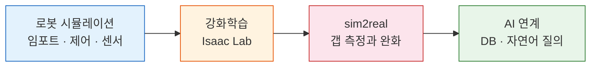

[:material-arrow-left: 전체 강의 목록](../../index.md){ .course-backlink }

# Isaac Sim 로보틱스 시뮬레이션 & AI 연계

**24시간 집중 과정 (8H × 3일)**

로봇을 시뮬레이션에 올리고, **강화학습으로 동작을 학습**시키고,
합성 데이터로 비전 모델을 만들어, 결과를 **자연어로 물어보는** 데까지 갑니다.

준비 중
24시간 · 3일
RTX 4080 필수

!!! warning "개설 준비 중 · 일부 내용은 최종 검증 전입니다"
    **강의 내용과 실습 자산은 모두 공개되어 있습니다.** 개강 일정만 미정입니다.

    다만 **Isaac Sim / Isaac Lab 실행이 필요한 실습은 아직 검증 전**입니다.
    코드는 공식 문서 기준으로 작성했고 문법 검사는 통과했으나,
    버전에 따라 API 이름이 다를 수 있습니다. 각 시간 페이지 상단에
    검증 상태를 표시해 두었습니다.

    | 표시 | 뜻 |
    |---|---|
    | ✅ | 실행 검증 완료 (GPU 불필요 구간) |
    | ⬜ | 최종 검증 전 |

!!! danger "등록 전 GPU 사양을 반드시 확인하세요"
    이 과정은 **RTX 4080 (16GB VRAM) 이상**이 필요합니다.
    사양이 미달이면 실습이 중간에 멈춥니다. → [사전 준비](setup.md)

---

## 이 과정이 답하는 질문

시뮬레이션에서 성공률 95% 인 로봇이 현장에서는 20% 도 안 나옵니다.
합성 데이터로 학습한 검사 모델이 실제 라인에서 불량을 놓칩니다.

**이것을 sim-to-real gap 이라고 합니다.**
이 과정의 절반은 이 갭을 다루는 데 씁니다.

## 대상

| | |
|---|---|
| **누구** | [Omniverse 디지털트윈 기초](../omniverse-digital-twin/index.md) 수료자, 로보틱스·AI 개발자 |
| **선수 지식** | Python 중급, OpenUSD 기초 |
| **불필요** | 강화학습 이론 사전 지식 |

!!! tip "기초 과정을 안 들었어도 수강할 수 있습니다"
    개강 1주 전 **OpenUSD 사전 학습 자료**를 배포하고, 첫 시간에 압축 복습을 합니다.
    기초 과정에서 만든 공용 씬도 완성본으로 제공되므로 바로 시작할 수 있습니다.

## 배우는 것

1. 로봇을 임포트하고 Python 으로 관절을 제어한다
2. 카메라·LiDAR·IMU 를 붙이고 좌표계와 시각을 정합한다
3. Replicator 로 도메인 랜덤화된 합성 데이터셋을 만든다
4. **Isaac Lab 으로 강화학습 환경을 직접 정의하고 정책을 학습시킨다**
5. sim-to-real 갭을 측정하고 완화한다
6. 결과를 DB 에 적재하고 **자연어로 질의**한다
7. Kit 확장을 만들어 자기 워크플로에 도구를 붙인다

## 최종 산출물

- **학습된 로봇 정책** — 자기 시나리오의 커스텀 태스크
- **보상 설계 근거** — 왜 그렇게 설계했는지 설명할 수 있을 것
- **합성 데이터셋 + 비전 모델** — 운영 지표(불량 유출·과검)로 보고
- **자연어 질의 데모** — 시뮬 결과를 DB 에서 자연어로

## 기술 스택

| 구분 | 도구 |
|---|---|
| 시뮬레이션 | **Isaac Sim** |
| 강화학습 | **Isaac Lab** (PPO · RSL-RL) |
| 합성데이터 | **Replicator** |
| 학습 | PyTorch |
| 데이터 | PostgreSQL · SQLAlchemy |
| AI 연계 | LangChain (기존 SQL 에이전트 재사용 가능) |

!!! info "기존 「AI 기반 SQL 분석 에이전트」 과정과 이어집니다"
    Day 3 에서 시뮬레이션 결과를 DB 에 적재하고 자연어로 질의합니다.
    [그 과정](../ai-sql-agent/index.md)을 들으신 분은 만들었던 에이전트를
    그대로 붙일 수 있습니다. 안 들으셨어도 규칙 기반 폴백으로 진행됩니다.

---

## 다음으로

-   :material-calendar-text:{ .lg .middle } **커리큘럼**

    ---

    24시간 · 3일을 시간 단위로.

    [:octicons-arrow-right-24: 커리큘럼 보기](curriculum.md)

-   :material-book-open-variant:{ .lg .middle } **강의 내용**

    ---

    시간별 상세 페이지가 공개되어 있습니다.

    [:octicons-arrow-right-24: Day 1 시작하기](day1/index.md)

-   :material-alert-circle-outline:{ .lg .middle } **사전 준비**

    ---

    **등록 전 사양 확인이 필수입니다.**

    [:octicons-arrow-right-24: 환경 준비](setup.md)

-   :material-flask-outline:{ .lg .middle } **실습 자산**

    ---

    스크립트·노트북 구조와 실행 방법.

    [:octicons-arrow-right-24: 실습 안내](labs.md)

