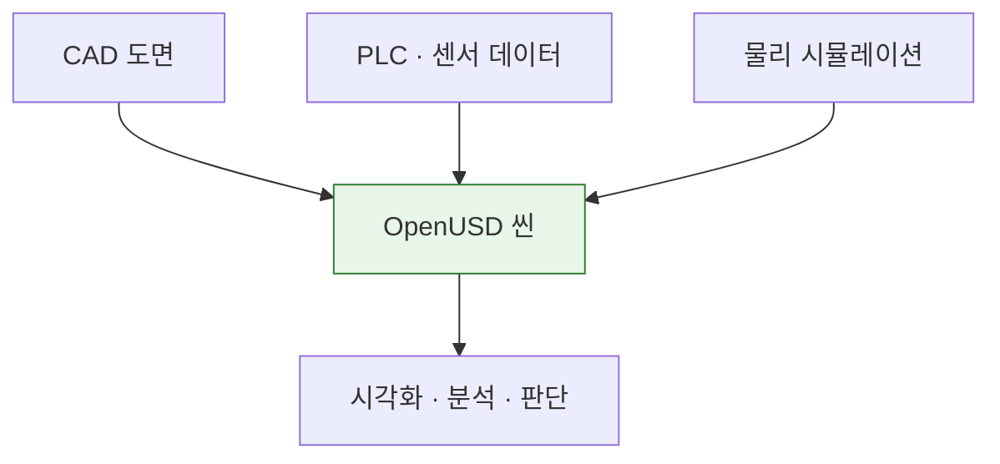

# 1H · OT & 완성 데모

## 학습 목표

- 디지털트윈이 무엇이고 **무엇이 아닌지** 구분한다
- 2일 뒤 자기가 무엇을 만들게 되는지 눈으로 본다

---

## 디지털트윈의 세 단계

"디지털트윈"이라는 말은 너무 넓게 쓰입니다. 성숙도로 나누면 이야기가 정리됩니다.

| 단계 | 설명 | 데이터 흐름 |
|---|---|---|
| **Digital Model** | 3D 모델만 있음. 실물과 연결 없음 | 없음 |
| **Digital Shadow** | 실물 → 모델 단방향. 현재 상태를 비춤 | 실물 → 모델 |
| **Digital Twin** | 양방향. 모델에서 판단해 실물에 반영 | 실물 ↔ 모델 |

!!! question "지금 현장에 있는 3D 모델은 셋 중 어디입니까?"
    대부분 **Digital Model** 입니다. 도면을 3차원으로 그린 것일 뿐,
    설비가 지금 어떤 상태인지는 알려주지 않습니다.

    이 과정에서는 **Shadow 까지** 만듭니다. Twin 으로 가려면 무엇이
    더 필요한지는 마지막 시간에 정리합니다.

## 왜 Omniverse 인가

핵심은 렌더링이 아니라 **OpenUSD** 입니다.

설비 하나에 CAD·PLC·센서·시뮬레이션이 다 붙는데, 각각 다른 도구를 씁니다.
USD 는 이것들을 한 씬에 **합성**하는 공통 형식입니다.
예쁜 화면은 부수 효과입니다.



---

## 완성본 데모

오늘 배울 조각들이 모여 무엇이 되는지 **먼저** 봅니다.

강사가 `SmartFactory-01` 완성본을 시연합니다.

1. 씬을 엽니다 — 컨베이어 · 검사 스테이션 · 버퍼가 있는 조립 라인
2. 타임라인을 재생합니다 — 값이 변합니다
3. 모터 온도가 70°C 를 넘는 지점 — **설비가 빨갛게 변합니다**
4. 같은 시각의 통과율 그래프 — **함께 떨어져 있습니다**

!!! question "왜 통과율이 떨어졌을까요?"
    답은 마지막 날이 아니라 **지금 데이터 안에** 있습니다.
    이틀 뒤 여러분이 직접 찾아내게 됩니다.

### 데이터에 심어 둔 인과관계

```
모터 온도 상승 (베어링 마모)
   └─▶ 보호 로직이 컨베이어 속도를 낮춤
          ├─▶ 사이클타임 증가   9.2s → 26s
          ├─▶ 통과율 하락      99.4% → 89.9%
          └─▶ 버퍼 고갈        46ea → 0ea
```

`Conveyor_B` 는 정상을 유지합니다. **비교군이 있어야** "A 만 이상하다"를
스스로 짚어낼 수 있습니다.

---

## 2일 로드맵

| | 오전 | 오후 |
|---|---|---|
| **Day 1** | OpenUSD — 씬은 파일이다 | Kit 앱 · 씬 조립 · 자동화 |
| **Day 2** | 물리 · 실시간 데이터 연동 | 시각화 · 시나리오 · 발표 |

## 과제 2건

| | 시점 | 내용 |
|---|---|---|
| **과제 #1** | Day 1 종료 | 대상 설비 선정 + 질문 5개 + 데이터 태그 목록 |
| **과제 #2** | Day 2 중 | 변형한 씬에 데이터 연동 + 상태 시각화 |

## 페어 편성

**엔지니어 + 개발자 2인 1조**를 권합니다.
도메인 지식과 코딩이 서로를 보완합니다. 혼자 하셔도 됩니다.

---

!!! tip "다음 시간"
    [2H · Omniverse 아키텍처](02-architecture.md) — Kit · USD · PhysX 가
    각각 무엇을 하는지, 왜 "설치"가 아니라 "빌드"인지.
