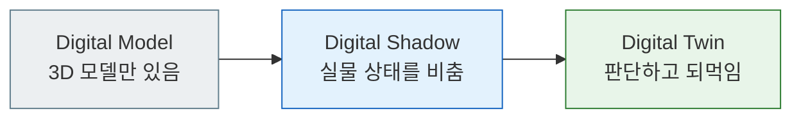

[:material-arrow-left: 전체 강의 목록](../../index.md){ .course-backlink }

# NVIDIA Omniverse 기반 디지털트윈 기초

**16시간 집중 과정 (8H × 2일)**

3D 모델을 **살아 움직이는 디지털트윈**으로 만듭니다.
설비 데이터가 흘러 들어와 씬이 반응하고, 이상이 색으로 드러나고,
"해 보기 전에" 결과를 예측하는 데까지 갑니다.

준비 중
16시간 · 2일
이론 30% · 실습 70%

!!! warning "개설 준비 중입니다"
    **강의 내용과 실습 자산은 모두 공개되어 있습니다.** 개강 일정만 미정입니다.
    수강 전에 미리 읽어 보셔도 좋고, 혼자 실습해 보셔도 됩니다.

    13H(OmniGraph) 의 UI 절차는 Omniverse 버전에 따라 달라질 수 있어
    개강 전 최종 확인 중입니다.

---

## 이 과정이 답하는 질문

현장의 3D 모델은 대개 **그림**입니다. 도면을 3차원으로 그린 것일 뿐,
설비가 지금 어떤 상태인지는 알려주지 않습니다.

이 과정은 그 그림에 **데이터를 연결**합니다.

16시간 안에 **Digital Shadow 까지 완성**하고, Twin 으로 가려면 무엇이
더 필요한지 이해하는 것이 목표입니다.

## 대상

| | |
|---|---|
| **누구** | 제조·설비·물류 실무자, 디지털트윈 입문 개발자 |
| **선수 지식** | Python 으로 `for`·함수·리스트를 읽고 고칠 수 있는 수준 |
| **불필요** | 3D·CAD·게임엔진 경험, 강화학습 이론 |

!!! tip "엔지니어와 개발자가 함께 듣는 과정입니다"
    Python 숙련도 차이를 전제로 설계했습니다. 모든 실습은 **동작하는 완성본을
    먼저 실행**하고 그다음 일부를 고치는 방식이며, 과제는 `TODO(basic)` /
    `TODO(advanced)` 두 단계로 나뉩니다. 기본 단계만 해도 진도가 나갑니다.

## 배우는 것

1. 디지털트윈의 성숙도 단계를 구분하고, 자기 현장에 무엇이 필요한지 판단한다
2. OpenUSD 의 Stage·Prim·Composition 을 이해하고 텍스트와 Python 양쪽으로 씬을 다룬다
3. Omniverse Kit 앱을 빌드·실행하고 CAD/3D 에셋으로 설비 레이아웃을 조립한다
4. 외부 실시간 데이터를 USD 속성에 바인딩해 **씬이 움직이게** 만든다
5. 상태를 색과 알람으로 드러내고, what-if 시나리오를 돌려본다

## 최종 산출물

공용 실습 씬 `SmartFactory-01` 을 **자기 도메인으로 변형한 디지털트윈**입니다.

- 레이어가 분리된 USD 씬
- 데이터가 흘러 들어와 반응하는 연동
- 정상 / 경고 / 이상이 눈으로 구분되는 시각화
- **트윈으로 답한 질문 1개**

마지막 시간에 5~7분 라이브 데모로 발표합니다.

## 기술 스택

| 구분 | 도구 |
|---|---|
| 씬 기술 | **OpenUSD** (`usd-core`) |
| 앱 프레임워크 | **Omniverse Kit** (`kit-app-template`) |
| 물리 | **PhysX** |
| 로직 | **OmniGraph / Action Graph** |
| 데이터 | Python · MQTT · PostgreSQL |

## 실습 환경

!!! danger "이 과정은 Google Colab 을 쓰지 않습니다"
    Omniverse Kit 은 **RT Core 를 가진 RTX GPU** 를 요구합니다.
    데이터센터 GPU(A100·H100)는 성능과 무관하게 지원되지 않습니다.
    **로컬 RTX PC** 에서 실습합니다 → [사전 준비](setup.md)

!!! success "GPU 가 없어도 Day 1 전반부는 참여할 수 있습니다"
    OpenUSD 파트는 `usd-core` 만 쓰므로 사양과 무관하게 전원 실습 가능합니다.
    사양이 부족한 경우 강의실 PC 배정 또는 2인 1조로 진행합니다.

---

## 다음으로

-   :material-calendar-text:{ .lg .middle } **커리큘럼**

    ---

    16시간을 시간 단위로 어떻게 쓰는지 확인하세요.

    [:octicons-arrow-right-24: 커리큘럼 보기](curriculum.md)

-   :material-book-open-variant:{ .lg .middle } **강의 내용**

    ---

    시간별 상세 페이지가 공개되어 있습니다.

    [:octicons-arrow-right-24: Day 1 시작하기](day1/index.md)

-   :material-cog-outline:{ .lg .middle } **사전 준비**

    ---

    내 PC 로 수강할 수 있는지 먼저 확인하세요.

    [:octicons-arrow-right-24: 환경 준비](setup.md)

-   :material-flask-outline:{ .lg .middle } **실습 자산**

    ---

    공용 씬과 실습 코드의 구조.

    [:octicons-arrow-right-24: 실습 안내](labs.md)

!!! info "이어지는 과정"
    이 과정을 마치면 **[Isaac Sim 로보틱스 & AI 연계 (24H)](../isaac-sim-robotics/index.md)**
    로 이어집니다. 여기서 만든 씬 위에 로봇을 올려 움직이게 하고, 강화학습으로
    동작을 학습시킨 뒤 AI 와 연결합니다. 단, **RTX 4080 / 16GB VRAM 이상**이 필요합니다.
