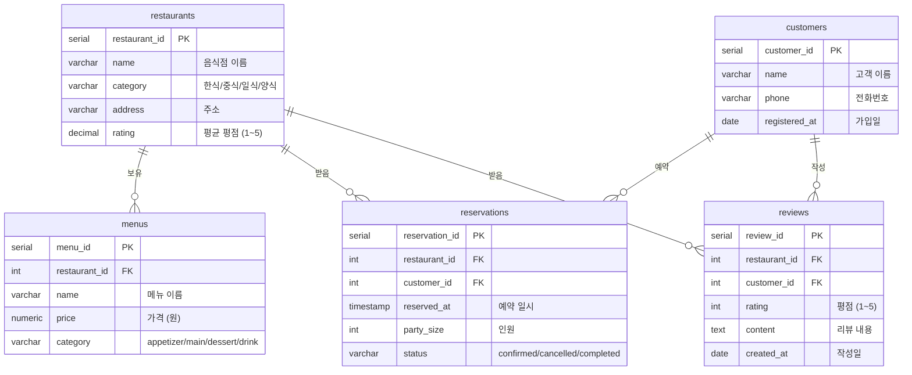
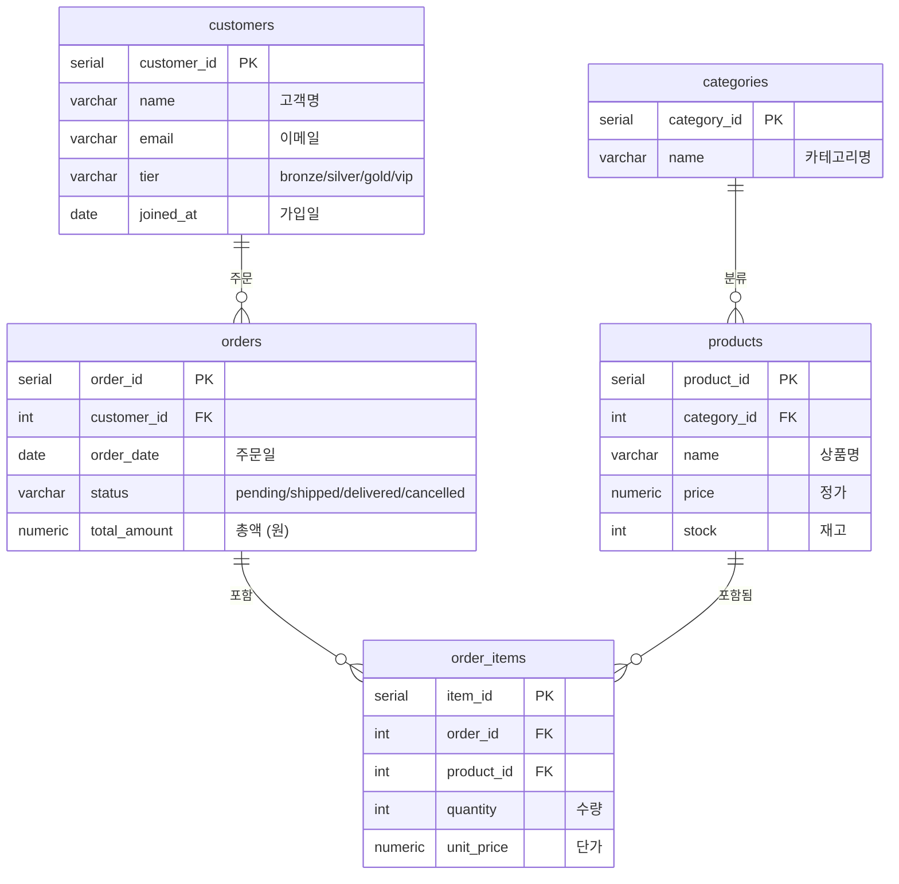
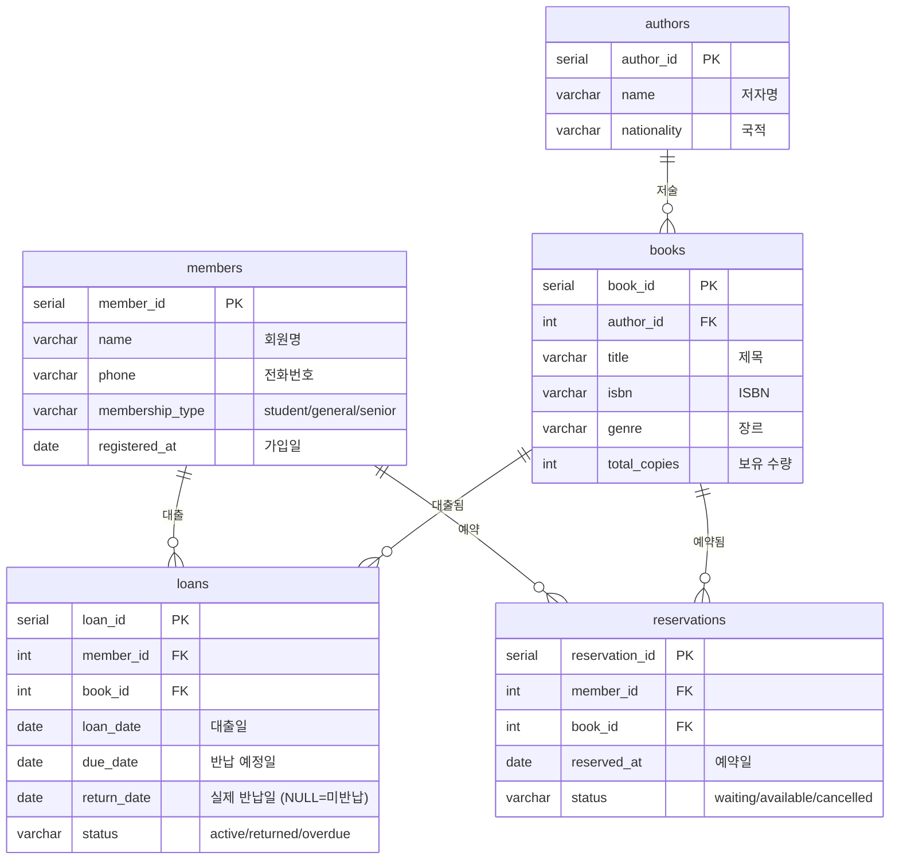

# 8H · 최종 프로젝트 브리핑

## 학습목표

- 최종 프로젝트의 전체 구조와 4단계 마일스톤을 이해한다
- 평가 루브릭을 파악하고 과제 #1(제안서) 작성 방법을 안다
- 본인 프로젝트 도메인을 선정하고 초기 스키마를 구상한다

<div class="colab-link" data-notebook="07_project_briefing"></div>

## 프로젝트 개요

```
🎯 최종 목표: 본인이 선택한 도메인의 SQL 분석 에이전트를 만들어 발표!

4단계 마일스톤:
Day 1 끝 → 과제 #1: 프로젝트 제안서 (도메인, 스키마, 질문 10개)
Day 2 끝 → 과제 #2: 스키마 + 시드 데이터 (Neon에 배포)
Day 3 끝 → 과제 #3: 에이전트 v1 (LangGraph)
Day 4    → 최종 발표 (5~7분, Ragas 평가 포함)
```

### 4단계 마일스톤 흐름

```
Day 1 (오늘)                Day 2                Day 3                Day 4
┌──────────┐            ┌──────────┐        ┌──────────┐        ┌──────────┐
│ 프로젝트   │            │ 과제 #1   │        │ 과제 #2   │        │ 과제 #3   │
│ 브리핑 수령 │ ────────→ │ 제안서    │ ───→   │ DB 구축   │ ───→   │ 에이전트  │
│            │           │ 제출      │        │ 완료      │        │ v1 제출   │
└──────────┘            └──────────┘        └──────────┘        └──────────┘
                                                                      │
                                                                      ▼
                                                                ┌──────────┐
                                                                │ 최종 발표 │
                                                                │ 5~7분    │
                                                                └──────────┘
```

### 평가 비중

| 항목 | 비중 | 핵심 |
|---|---|---|
| 기능/동작 | 30% | 10개 질문 중 7개 이상 정답 |
| Ragas 평가 | 25% | Faithfulness, Relevancy 등 정량 점수 |
| LangGraph 설계 | 20% | 상태 관리, 분기/루프, 에러 처리 |
| 최종 발표 | 15% | 명확성, 데모, 회고의 깊이 |
| 과제 성실도 | 10% | 3건 기한 내 제출 |

---

## 과제 #1 — 프로젝트 제안서

### 제안서에 포함할 내용

| 항목 | 설명 | 예시 |
|---|---|---|
| 도메인 | 분석 대상 | 음식점 예약 시스템 |
| 테이블 | 3~5개 | restaurants, reservations, reviews, menus |
| 질문 10개 | Easy 3~4, Medium 3~4, Hard 2~3 | "이번 달 예약 수는?" |
| 기대 SQL | 각 질문에 대한 정답 SQL | `SELECT COUNT(*) ...` |
| ERD | 테이블 간 관계 | Mermaid 다이어그램 |

### 도메인 선정 팁

```
✅ 좋은 도메인 (3~5 테이블로 충분):
  - 음식점/카페 관리 시스템
  - 온라인 쇼핑몰 (상품-주문-고객)
  - 도서관/서점 (도서-대출-회원)
  - 피트니스 센터 (회원-수업-예약)
  - 영화관 (영화-상영-예매)

❌ 피해야 할 도메인:
  - 테이블이 10개 이상 필요한 것
  - 데이터 구하기가 어려운 것
  - 업무 지식이 너무 전문적인 것
```

!!! tip "도메인 선택 비법"
    **본인이 잘 아는 도메인**을 선택하세요! 도메인 지식이 높을수록 스키마 품질이 좋아지고, 자연스러운 질문을 만들 수 있으며, 에이전트 정확도도 올라갑니다.

    - 매일 사용하는 서비스를 떠올려보세요: 넷플릭스? 배달앱? 카페?
    - 알바 경험이 있는 곳의 업무 시스템도 좋습니다

---

## 좋은 제안서 vs 나쁜 제안서

### 나쁜 제안서 예시

!!! warning "이런 제안서는 감점됩니다"
    축약 컬럼명, COMMENT 없음, FK 없음, 단일 테이블, Easy 질문만 있는 제안서입니다.

```sql
CREATE TABLE ord (
    id INT PRIMARY KEY,
    cust INT,
    dt DATE,
    amt DECIMAL
);
-- COMMENT 없음, FK 없음, 컬럼명 약어
```

```
Q1: 주문 수는? → SELECT COUNT(*) FROM ord;
Q2: 고객 수는? → SELECT COUNT(DISTINCT cust) FROM ord;
Q3: 총 매출은? → SELECT SUM(amt) FROM ord;
-- 모두 Easy, 테이블 1개만 사용
```

문제점:

- `ord`, `cust`, `dt`, `amt` -- LLM이 의미를 파악하기 어려운 약어
- COMMENT ON이 없어서 LLM이 컬럼 의미를 추측해야 함
- FK가 없어서 JOIN 경로를 알 수 없음
- 질문이 모두 Easy 난이도 -- 에이전트 성능 검증 불가

### 좋은 제안서 예시

```sql
CREATE TABLE orders (
    order_id    SERIAL PRIMARY KEY,
    customer_id INT NOT NULL REFERENCES customers(customer_id),
    order_date  DATE NOT NULL,
    status      VARCHAR(20) CHECK (status IN ('pending','shipped','delivered','cancelled')),
    total_amount NUMERIC(12,2) NOT NULL
);
COMMENT ON TABLE orders IS '고객 주문 정보';
COMMENT ON COLUMN orders.status IS '주문 상태: pending=처리중, shipped=배송중, delivered=배송완료, cancelled=취소';
COMMENT ON COLUMN orders.total_amount IS '주문 총액 (원, VAT 포함)';
```

```
[Easy] Q1: "이번 달 총 주문 건수는?"
SQL: SELECT COUNT(*) FROM orders WHERE order_date >= DATE_TRUNC('month', CURRENT_DATE);

[Medium] Q5: "카테고리별 월 매출 추이를 보여주세요."
SQL:
  SELECT c.category_name, TO_CHAR(o.order_date, 'YYYY-MM') AS month,
         SUM(oi.quantity * oi.unit_price) AS revenue
  FROM order_items oi
  JOIN products p ON p.product_id = oi.product_id
  JOIN categories c ON c.category_id = p.category_id
  JOIN orders o ON o.order_id = oi.order_id
  WHERE o.status = 'delivered'
  GROUP BY c.category_name, month
  ORDER BY month, revenue DESC;

[Hard] Q9: "재구매율이 가장 높은 상위 3개 제품은?"
SQL:
  WITH purchase_counts AS (
      SELECT oi.product_id, COUNT(DISTINCT o.customer_id) AS buyers,
             COUNT(DISTINCT CASE WHEN ... END) AS repeat_buyers
      FROM ...
  )
  SELECT p.product_name, pc.repeat_buyers * 100.0 / pc.buyers AS repeat_rate
  FROM purchase_counts pc
  JOIN products p ON p.product_id = pc.product_id
  ORDER BY repeat_rate DESC LIMIT 3;
```

차이점:

- 명시적 컬럼명 (`order_date`, `customer_id`, `total_amount`)
- COMMENT ON으로 모든 컬럼에 한국어 설명
- FK 제약 조건으로 테이블 간 관계 명시
- Easy/Medium/Hard 질문 골고루 분포
- 각 질문에 실행 가능한 기대 SQL 포함

---

## Mermaid ERD 작성 가이드

!!! tip "ERD를 Mermaid로 5분 만에 그리기"
    Mermaid는 텍스트로 다이어그램을 그리는 도구입니다. MkDocs, GitHub, Notion 등에서 바로 렌더링됩니다.

### Mermaid ERD 기본 문법

```markdown
erDiagram
    테이블A ||--o{ 테이블B : "관계 설명"
    테이블A {
        type column_name "설명"
    }
```

**관계 기호:**

| 기호 | 의미 |
|---|---|
| `\|\|--o{` | 1:N (하나 대 다수) |
| `\|\|--\|\|` | 1:1 (하나 대 하나) |
| `}o--o{` | N:M (다수 대 다수) |
| `o` | 선택 (0 이상) |
| `\|` | 필수 (1 이상) |

### 도메인별 테이블 설계 예시

#### 예시 1: 음식점 예약 시스템



#### 예시 2: 온라인 쇼핑몰



#### 예시 3: 도서관 시스템



---

## 제안서 양식

```markdown
# 프로젝트 제안서

## 1. 도메인: ________________
## 2. 대상 사용자: ________________
## 3. 해결할 문제: ________________

## 4. 테이블 설계

### 테이블 1: ________________
CREATE TABLE ... (
    ...
);
COMMENT ON TABLE ...;
COMMENT ON COLUMN ...;

### 테이블 2: ________________
(동일한 형식으로 반복)

## 5. 질문 10개

[Easy] Q1: "________________"
SQL: ...

[Easy] Q2: "________________"
SQL: ...

[Easy] Q3: "________________"
SQL: ...

[Medium] Q4: "________________"
SQL: ...

[Medium] Q5: "________________"
SQL: ...

[Medium] Q6: "________________"
SQL: ...

[Medium] Q7: "________________"
SQL: ...

[Hard] Q8: "________________"
SQL: ...

[Hard] Q9: "________________"
SQL: ...

[Hard] Q10: "________________"
SQL: ...

## 6. ERD (Mermaid)

erDiagram
    ...
```

---

!!! example "실습"
    **본인 도메인의 ERD 초안을 Mermaid로 작성하세요.**

    1. 도메인을 정하세요 (5분)
    2. 핵심 테이블 3~5개의 이름과 주요 컬럼을 구상하세요 (10분)
    3. 아래 템플릿을 복사하여 채워보세요:

    ```
    erDiagram
        테이블A ||--o{ 테이블B : "관계"
        테이블A {
            serial id PK
            varchar name "이름"
        }
        테이블B {
            serial id PK
            int a_id FK
            varchar description "설명"
        }
    ```

    4. 질문 10개를 난이도별로 작성하세요 (20분)
    5. 나머지는 집에서 완성하여 **내일(Day 2) 9H에 제출**

---

## 과제 #1 루브릭 상세 (배점 기준)

| 평가 항목 | 배점 | A (우수) | B (보통) | C (미흡) |
|---|---|---|---|---|
| **도메인 적절성** | 10점 | 3~5 테이블로 표현 가능, 실용적인 도메인 | 테이블 수가 약간 많거나 적음 | 너무 단순하거나 너무 복잡한 도메인 |
| **테이블 설계** | 20점 | 모든 테이블에 PK/FK 명시, 적절한 데이터 타입, CHECK 제약 | PK 있으나 일부 FK 누락, 데이터 타입 일부 부적절 | PK/FK 대부분 누락, 데이터 타입 부적절 |
| **COMMENT ON** | 20점 | 모든 컬럼에 한국어 설명 (100%) | 70% 이상 컬럼에 COMMENT 있음 | 50% 미만 또는 COMMENT 없음 |
| **질문 난이도 분포** | 20점 | Easy 3~4 / Medium 3~4 / Hard 2~3 고르게 분포 | 난이도 분포가 약간 편향 (Easy 과다) | 한 난이도에 집중 (예: Easy만 10개) |
| **기대 SQL** | 20점 | 10개 질문 모두 실행 가능한 SQL 포함, 결과 행 수 기재 | 7개 이상 SQL 포함, 일부 부정확 | 5개 미만이거나 SQL 대부분 부정확 |
| **ERD** | 10점 | Mermaid 또는 이미지로 관계 명확히 시각화 | ERD 있으나 일부 관계 누락 | ERD 없음 |
| **합계** | **100점** | | | |

!!! warning "감점 요소"
    - 컬럼명이 3글자 이하 약어인 경우: -5점/건
    - FK 관계가 있는데 FOREIGN KEY 제약 조건이 없는 경우: -3점/건
    - 질문에 기대 SQL이 아예 없는 경우: -5점/건

---

### 실습 체크리스트 -- 과제 #1

- [ ] 도메인 선정 완료
- [ ] 테이블 3~5개 설계 (CREATE TABLE + COMMENT ON)
- [ ] 질문 10개 작성 (Easy/Medium/Hard 분포)
- [ ] 각 질문에 기대 SQL 작성
- [ ] ERD 초안 작성 (Mermaid)

!!! note "핵심 정리"
    - **과제 #1** = Day 2 시작 시 제출하는 프로젝트 제안서
    - 도메인은 **3~5개 테이블**로 표현 가능한 것을 선택
    - **COMMENT ON**을 모든 컬럼에 달아야 AI가 잘 이해함
    - 질문 난이도를 **Easy/Medium/Hard로 분산**시키기
    - ERD는 Mermaid로 5분이면 작성 가능

---

!!! note "Day 1 전체 정리"

    | 시간 | 주제 | 핵심 키워드 |
    |---|---|---|
    | 1H | OT & 데모 | Agentic Analytics, 환경 셋업 |
    | 2H | PostgreSQL 기초 | SELECT, WHERE, ORDER BY, LIMIT |
    | 3H | 집계/조인 | GROUP BY, JOIN, CTE, 윈도우 함수 |
    | 4H | Schema Intelligence | COMMENT ON, FK, 리포팅 뷰, ERD |
    | 5H | LlamaIndex | RAG, Documents -> Index -> Query |
    | 6H | 임베딩 + ChromaDB | 벡터, 코사인 유사도, 영속 저장 |
    | 7H | Text-to-SQL | NLSQLTableQueryEngine, 성공과 실패 |
    | 8H | 프로젝트 브리핑 | 과제 #1: 제안서 작성 |

    **내일(Day 2) 예고**: 제안서 피어리뷰 -> Text-to-SQL 정확도 높이기 -> 병원 상담사 만들기 -> Gradio UI!
