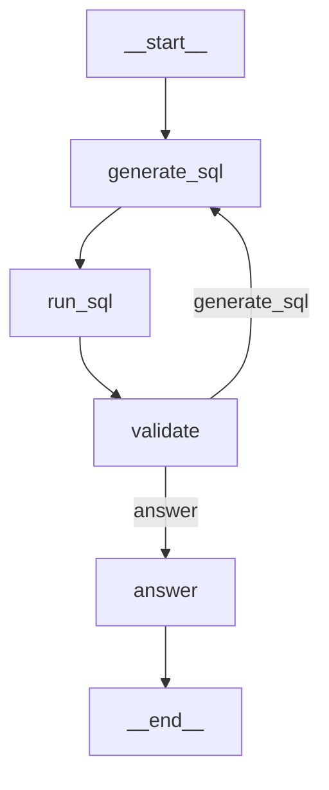

# 20H -- SQL 에이전트 빌드

## 학습목표

- LangGraph로 완전한 SQL 분석 에이전트를 구축할 수 있다
- generate_sql -> run_sql -> validate -> answer 노드 구조를 구현할 수 있다
- 보안 가드레일을 에이전트에 통합할 수 있다
- 본인 프로젝트 DB에 에이전트를 연결할 수 있다

!!! tip "이 시간이 과정의 정점입니다!"
    Day 1에서 배운 SQL, Day 2의 Text-to-SQL, Day 3의 LangChain/LangGraph -- 모든 것이 합쳐집니다.
    여기서 만드는 에이전트가 과제 #3의 기반이 됩니다.

---

<div class="colab-link" data-notebook="17_my_sql_agent"></div>

## 에이전트 아키텍처

```
질문 --> [generate_sql] --> [run_sql] --> [validate] --> [answer] --> 답변
                ^                            |
                +------ 에러 시 재시도 -------+
                       (최대 3회)
```

| 노드 | 역할 | 입력 | 출력 |
|---|---|---|---|
| **generate_sql** | 질문을 SQL로 변환 | question, (error) | sql |
| **run_sql** | SQL을 DB에서 실행 | sql | sql_result or error |
| **validate** | 결과 검증 | sql_result, error | error (비어있으면 성공) |
| **answer** | 결과를 자연어로 요약 | question, sql, sql_result | answer |

---

## 패키지 설치 및 환경 설정

```python
# ============================================================
# 0. 패키지 설치
# ============================================================
!pip install -q langgraph langchain-openai sqlalchemy psycopg2-binary \
    pandas tabulate sqlparse openai

import os, re
from google.colab import userdata
os.environ["OPENAI_API_KEY"] = userdata.get("OPENAI_API_KEY")
os.environ["NEON_DSN"]       = userdata.get("NEON_DSN")

from sqlalchemy import create_engine, text, inspect
import pandas as pd

engine = create_engine(os.environ["NEON_DSN"])
```

---

## 스키마 정보 수집

DB에서 테이블 구조를 자동으로 수집하여 LLM 프롬프트에 사용할 수 있는 DDL 형태로 변환합니다.

```python
# ============================================================
# 1. 스키마 정보 수집
# ============================================================
def collect_schema(engine, tables: list[str] = None) -> str:
    """DB 스키마를 LLM 프롬프트용 텍스트로 변환"""
    inspector = inspect(engine)
    if tables is None:
        tables = inspector.get_table_names()

    parts = []
    for table in tables:
        columns = inspector.get_columns(table)
        fks = inspector.get_foreign_keys(table)

        col_lines = []
        for col in columns:
            nullable = "" if col["nullable"] else " NOT NULL"
            col_lines.append(f"    {col['name']} {col['type']}{nullable}")

        fk_lines = []
        for fk in fks:
            fk_lines.append(
                f"    FOREIGN KEY ({', '.join(fk['constrained_columns'])}) "
                f"REFERENCES {fk['referred_table']}({', '.join(fk['referred_columns'])})"
            )

        ddl = f"CREATE TABLE {table} (\n"
        ddl += ",\n".join(col_lines)
        if fk_lines:
            ddl += ",\n" + ",\n".join(fk_lines)
        ddl += "\n);"

        # COMMENT 수집 (pg_attribute.attnum 기반 — ordinal_position과 다를 수 있음)
        with engine.connect() as conn:
            comments = conn.execute(
                text("""
                    SELECT a.attname,
                           col_description(c.oid, a.attnum) AS comment
                    FROM pg_class c
                    JOIN pg_namespace n ON n.oid = c.relnamespace
                    JOIN pg_attribute a ON a.attrelid = c.oid
                    WHERE c.relname = :table
                      AND n.nspname = 'public'
                      AND a.attnum > 0
                      AND NOT a.attisdropped
                    ORDER BY a.attnum
                """),
                {"table": table},
            ).fetchall()

        for col_name, comment in comments:
            if comment:
                ddl += f"\n-- {table}.{col_name}: {comment}"

        parts.append(ddl)

    return "\n\n".join(parts)

TABLES = ["patients", "doctors", "visits", "diagnoses", "departments"]
SCHEMA = collect_schema(engine, TABLES)
print(SCHEMA[:500] + "...")
```

!!! note "핵심 정리"
    `collect_schema`는 `SQLAlchemy Inspector`를 사용하여:

    1. 각 테이블의 **컬럼 정보** (이름, 타입, NULL 가능 여부)
    2. **외래 키 관계** (FK)
    3. **컬럼 COMMENT** (PostgreSQL의 `COMMENT ON COLUMN`)
    를 자동으로 수집합니다.

---

## 에이전트 상태 정의

```python
# ============================================================
# 2. 에이전트 상태 정의
# ============================================================
from typing import TypedDict
from langgraph.graph import StateGraph, END

class SQLAgentState(TypedDict):
    question: str           # 사용자 질문
    sql: str                # 생성된 SQL
    sql_result: str         # SQL 실행 결과
    error: str              # 에러 메시지
    answer: str             # 최종 자연어 답변
    attempts: int           # 재시도 횟수
    history: list           # 대화 히스토리
```

!!! tip "상태 설계 원칙"
    - 모든 노드가 읽고 쓸 수 있는 **공유 데이터**입니다
    - 노드는 상태 전체가 아닌 **변경할 부분만** 반환합니다
    - `attempts`로 무한 루프를 방지합니다 (최대 3회)
    - `error`가 비어있으면 성공, 값이 있으면 실패를 의미합니다

!!! warning "TypedDict는 기본값이 없습니다"
    `TypedDict`는 **타입 힌트만** 제공하고, 키가 자동으로 채워지지 않습니다. `agent.invoke(...)` 호출 시 `attempts`, `history`를 **명시적으로 초기화**하지 않으면, 내부에서 `state["attempts"] + 1` 같은 연산이 `KeyError`로 터집니다. 본 페이지 예시가 일관되게 `{"question": q, "attempts": 0, "history": []}`로 시작하는 이유입니다. 본인 프로젝트도 모든 `invoke` 진입점에서 초기화를 지키세요.

!!! note "`history` 필드는 스캐폴드 -- 오늘은 쓰지 않습니다"
    `history` 키는 **멀티턴 확장용 자리**로 선언만 해둡니다. 본 20H 예시는 싱글턴(한 질문 = 한 실행)이라 실제로 읽거나 쓰지 않습니다.
    본인 프로젝트에서 멀티턴으로 확장한다면 다음 중 한 방향을 고르세요.

    - **간단 경로**: `answer` 노드에서 `return {"history": state.get("history", []) + [(state["question"], ans)]}` 로 append, 다음 `invoke` 호출 시 `history=이전값` 으로 넘겨줌.
    - **정석 경로**: 19H에서 배운 **Checkpointer(MemorySaver)** 를 `compile(checkpointer=...)` 에 꽂고 `config={"configurable": {"thread_id": "user-1"}}` 로 실행 → LangGraph 가 자동으로 상태를 복원합니다 (멀티턴·재시작 모두 공짜).

    오늘은 비워두고, 본인 프로젝트 요구사항(단건 Q&A vs 연속 대화)에 맞춰 둘 중 하나를 선택하세요.

---

## 보안 가드레일

```python
# ============================================================
# 3. 보안 가드레일
# ============================================================
BLOCKED_SQL = re.compile(
    r"\b(DROP|DELETE|UPDATE|INSERT|ALTER|TRUNCATE|CREATE|GRANT|REVOKE)\b",
    re.IGNORECASE,
)

def sanitize_sql(sql: str) -> tuple[str, str]:
    """SQL 검증 + LIMIT 주입. (정제SQL, 에러메시지) 반환"""
    match = BLOCKED_SQL.search(sql)
    if match:
        return "", f"보안 위반: '{match.group()}' 명령 차단"

    # LIMIT 주입
    if "LIMIT" not in sql.upper():
        sql = sql.rstrip().rstrip(";") + "\nLIMIT 1000;"

    return sql, ""
```

!!! danger "정규식 가드는 **보조 방어선**일 뿐 — 진짜 방어는 read-only 세션"
    `BLOCKED_SQL` 블랙리스트는 다음 케이스를 **못 막습니다**. Day 2 11H 와 같은 문제가 본인 프로젝트에도 그대로 이식되지 않도록 주의하세요.

    - data-modifying CTE: `WITH x AS (DELETE FROM visits RETURNING *) SELECT * FROM x` — DELETE 는 잡히지만 `UPDATE ... RETURNING *` 을 섞으면 쉽게 우회됩니다.
    - 함수 안에 숨긴 쓰기: `DO $$ BEGIN DELETE FROM visits; END $$;` — 키워드가 문자열·함수 본문에 숨으면 놓치기 쉬움.
    - `COPY FROM PROGRAM ...` — 서버 쉘 실행으로 연결될 수 있습니다.
    - 대소문자·전각 유니코드 치환 등 (`ＤＲＯＰ`).

    **진짜 방어선 — 반드시 둘 다 적용**:

    1. **에이전트 전용 read-only 세션** — [사전 준비 > 공통 부트스트랩](../setup.md#bootstrap-common) 의 `agent_engine` 처럼 `connect_args={"options": "-c default_transaction_read_only=on"}` 으로 만든 엔진만 에이전트에 전달하세요. LLM 이 어떤 SQL 을 만들어도 DB 가 `cannot execute ... in a read-only transaction` 으로 거부합니다.
    2. **DB 롤 분리** — Neon 대시보드에서 `agent_ro` 롤에 `GRANT SELECT ON ALL TABLES IN SCHEMA public` 만 부여, 에이전트 커넥션은 이 롤로 접속.

    `sanitize_sql` 은 **오탐·오답을 일찍 잡는 보조 장치**일 뿐이지 최종 방어선이 아닙니다. 본인 프로젝트에서 read-only 세션은 선택이 아니라 필수로 적용하세요.

!!! note "가드레일이 보장하는 것"
    1. **위험 키워드 1차 차단**: DROP, DELETE, UPDATE 등이 SQL 문자열에 명시적으로 보이는 경우를 잡아, LLM 프롬프트로 돌려 재생성을 유도합니다.
    2. **LIMIT 강제**: 대량 데이터 조회 방지 (최대 1000행).

!!! warning "LIMIT 주입은 단순 SELECT 가정"
    위 `sanitize_sql`의 LIMIT 주입은 `SELECT ... FROM ... [WHERE/GROUP/ORDER] ;` 형태를 가정합니다. 다음 구조에서는 **의도한 위치에 붙지 않거나 문법 오류**를 만듭니다:

    - `WITH cte AS (...) SELECT ...` — 마지막 `SELECT`에 붙여야 합니다(기본 동작은 문자열 끝에 붙으므로 운 좋게 맞음).
    - `SELECT ... UNION SELECT ...` — 전체를 감싸는 외부 `SELECT * FROM (...) LIMIT n` 로 바꿔야 합니다.
    - 이미 `LIMIT`이 있는 서브쿼리 — 상위 `SELECT`에는 안 붙는 사례가 생깁니다.

    본인 프로젝트에서 CTE/UNION 질문 유형이 많다면, `sqlglot` 같은 파서로 AST 수준에서 LIMIT 을 삽입하세요. 학습용으로는 프롬프트에 "최대 1000행만 조회" 규칙을 명시하는 것만으로도 대부분 해결됩니다.

---

## 노드 함수 구현

### 노드 1: SQL 생성 (generate_sql)

```python
# ============================================================
# 4. 노드 함수 구현
# ============================================================
from langchain_openai import ChatOpenAI
from langchain_core.prompts import ChatPromptTemplate
from langchain_core.output_parsers import StrOutputParser

llm = ChatOpenAI(model="gpt-4o-mini", temperature=0)

# --- 노드 1: SQL 생성 ---
def generate_sql(state: SQLAgentState) -> dict:
    error_feedback = ""
    if state.get("error"):
        error_feedback = f"""
이전 시도에서 오류가 발생했습니다:
- 오류: {state['error']}
- 실패한 SQL: {state.get('sql', '')}
이 오류를 피해서 SQL을 다시 작성하세요."""

    prompt = ChatPromptTemplate.from_template("""PostgreSQL 전문가로서 SQL을 작성하세요.

## 스키마
{schema}

## 규칙
- SELECT 문만 작성. DML/DDL 금지.
- visits.status = 'completed'만 유효한 진료.
- 나이 = EXTRACT(YEAR FROM AGE(birth_date))
- SQL만 반환 (설명 없이).
{error_feedback}

## 질문
{question}

SQL:""")

    chain = prompt | llm | StrOutputParser()
    sql = chain.invoke({
        "schema": SCHEMA,
        "question": state["question"],
        "error_feedback": error_feedback,
    })

    # 마크다운 코드 블록 제거
    sql = re.sub(r"```sql\s*", "", sql)
    sql = re.sub(r"```\s*", "", sql).strip()

    return {"sql": sql, "attempts": state.get("attempts", 0) + 1}
```

!!! note "핵심 정리"
    `generate_sql`의 핵심 기능:

    1. **에러 피드백**: 이전 시도에서 실패한 경우, 에러 메시지와 실패 SQL을 프롬프트에 포함
    2. **비즈니스 규칙 주입**: `visits.status = 'completed'` 등의 규칙을 프롬프트에 명시
    3. **마크다운 제거**: LLM이 ```sql 블록으로 감싸는 경우 제거

### 노드 2: SQL 실행 (run_sql)

```python
# --- 노드 2: SQL 실행 ---
def run_sql(state: SQLAgentState) -> dict:
    sql = state["sql"]
    safe_sql, error = sanitize_sql(sql)

    if error:
        return {"error": error, "sql_result": ""}

    try:
        # pandas 2.2+ 에서는 raw 문자열 대신 SQLAlchemy `text()` 권장.
        # 경고 없이 호환되고, 파라미터 바인딩 확장에도 유리합니다.
        df = pd.read_sql(text(safe_sql), engine)
        if df.empty:
            return {"sql_result": "(결과 없음 -- 조건을 확인하세요)", "error": ""}

        result = df.head(50).to_markdown(index=False)
        if len(df) > 50:
            result += f"\n\n... 외 {len(df) - 50}행"
        return {"sql_result": result, "error": ""}
    except Exception as e:
        return {"error": f"SQL 실행 오류: {str(e)}", "sql_result": ""}
```

### 노드 3: 검증 (validate)

```python
# --- 노드 3: 검증 ---
def validate(state: SQLAgentState) -> dict:
    # 에러가 있으면 그대로 전달 (재시도 분기에서 처리)
    if state.get("error"):
        return state
    # 빈 결과는 "에러"가 아님 -- 정상 조회지만 매칭이 없었을 뿐.
    # 여기서 error로 만들면 재시도 3회를 낭비하게 됩니다.
    # 대신 사용자에게 "결과 없음"을 그대로 전달하도록 통과시킵니다.
    return {"error": ""}
```

!!! warning "빈 결과를 에러 취급하지 마세요"
    SQL이 문법적으로 올바르고 실행까지 성공했는데 **매칭되는 행이 0개**인 상황은 **정상 결과**입니다. 예: "2099년 방문 수" 같은 질문은 0 행이 자연스러운 답입니다. 이 경우를 `error`로 되돌리면 재시도 루프를 3회까지 낭비하고 결국 사용자에게는 "죄송합니다" 메시지가 나갑니다.

    질문을 잘못 해석해 빈 결과가 나왔는지 판정하려면, 빈 결과 자체가 아니라 **LLM의 재판정**(예: "이 결과가 질문의 의도와 일치하나요?" 프롬프트)을 추가하세요. 학습 단계에서는 그대로 답변 노드로 넘겨 "결과 없음"을 정직하게 전달하는 쪽이 더 안전합니다.

### 노드 4: 답변 생성 (answer)

```python
# --- 노드 4: 답변 생성 ---
def answer(state: SQLAgentState) -> dict:
    if state.get("error") and state.get("attempts", 0) >= 3:
        return {"answer": f"죄송합니다. 질문에 답변하지 못했습니다.\n오류: {state['error']}"}

    prompt = ChatPromptTemplate.from_template("""SQL 결과를 한국어로 요약하세요.

질문: {question}
SQL: {sql}
결과:
{result}

규칙: 숫자에 천 단위 구분자. 핵심만 간결하게.""")

    chain = prompt | llm | StrOutputParser()
    ans = chain.invoke({
        "question": state["question"],
        "sql": state["sql"],
        "result": state["sql_result"][:1500],
    })
    return {"answer": ans}
```

### 분기 함수 (should_retry)

```python
# --- 분기 함수 ---
MAX_ATTEMPTS = 3

def should_retry(state: SQLAgentState) -> str:
    """
    세 가지 결과 중 하나로 분기:
    - "answer"  : 에러 없음 → 정상 답변 노드로
    - "giveup"  : 에러 있음 + 재시도 소진 → 답변 노드(사과 메시지)로
    - "retry"   : 에러 있음 + 재시도 여유 → SQL 생성으로 되돌림
    """
    if not state.get("error"):
        return "answer"
    if state.get("attempts", 0) >= MAX_ATTEMPTS:
        return "giveup"
    return "retry"
```

!!! tip "분기 결과는 `path_map`으로 **명시적 라우팅**"
    `add_conditional_edges(node, fn)`만 쓰면 반환값이 곧 **다음 노드 이름**이어야 합니다. 위처럼 `"answer"/"giveup"/"retry"` 같은 **의도 라벨**을 반환하면 `path_map`으로 실제 노드에 매핑해야 LangGraph가 이해합니다.

    ```python
    graph.add_conditional_edges(
        "validate",
        should_retry,
        path_map={
            "answer": "answer",        # 성공 → 답변
            "giveup": "answer",        # 재시도 소진 → 같은 answer 노드에서 사과 메시지 분기
            "retry":  "generate_sql",  # 재시도 여유 → SQL 생성으로
        },
    )
    ```

    "에러 없음"과 "재시도 소진"이 같은 노드로 가더라도 **라벨을 분리**해두면 LangSmith 트레이스·디버깅에서 경로가 명확해집니다. 네이밍이 동작을 거짓말하지 않게 하는 것이 핵심입니다.

---

## 그래프 조립 + 컴파일

```python
# ============================================================
# 5. 그래프 조립 + 컴파일
# ============================================================
graph = StateGraph(SQLAgentState)

graph.add_node("generate_sql", generate_sql)
graph.add_node("run_sql", run_sql)
graph.add_node("validate", validate)
graph.add_node("answer", answer)

graph.set_entry_point("generate_sql")
graph.add_edge("generate_sql", "run_sql")
graph.add_edge("run_sql", "validate")
graph.add_conditional_edges(
    "validate",
    should_retry,
    path_map={
        "answer": "answer",
        "giveup": "answer",
        "retry":  "generate_sql",
    },
)
graph.add_edge("answer", END)

agent = graph.compile()

# 시각화
try:
    from IPython.display import Image, display
    display(Image(agent.get_graph().draw_mermaid_png()))
except:
    print(agent.get_graph().draw_mermaid())
```



---

## 에이전트 실행 + 추적

`ask_agent` 함수는 에이전트에 질문하고, `stream()`으로 각 노드의 실행 과정을 추적합니다.

```python
# ============================================================
# 6. 에이전트 실행 + 추적
# ============================================================
def ask_agent(question: str, verbose: bool = True) -> dict:
    """에이전트에 질문하고 과정을 추적"""
    print(f"\n{'='*60}")
    print(f"❓ {question}")
    print(f"{'='*60}")

    if verbose:
        for event in agent.stream({"question": question, "attempts": 0, "history": []}):
            for node_name, output in event.items():
                print(f"\n📍 [{node_name}]")
                if "sql" in output and output["sql"]:
                    print(f"   SQL: {output['sql'][:100]}...")
                if "error" in output and output["error"]:
                    print(f"   ❌ Error: {output['error']}")
                if "answer" in output and output["answer"]:
                    print(f"   💬 Answer: {output['answer']}")
    else:
        result = agent.invoke({"question": question, "attempts": 0, "history": []})
        print(f"\n📝 SQL: {result['sql']}")
        print(f"💬 답변: {result['answer']}")
        return result

# 테스트
ask_agent("현재 등록된 환자 수는 몇 명인가요?")
ask_agent("진료과별 의사 수를 보여주세요.")
ask_agent("지난 3개월간 가장 많이 방문한 환자 Top 5는?")
```

!!! example "실습 -- 에이전트 실행 추적"
    `verbose=True`로 실행하면 각 노드를 거치는 과정이 출력됩니다:

    ```
    ============================================================
    ❓ 현재 등록된 환자 수는 몇 명인가요?
    ============================================================

    📍 [generate_sql]
       SQL: SELECT COUNT(*) AS total_patients FROM patients...

    📍 [run_sql]
       (SQL 실행 성공)

    📍 [validate]
       (에러 없음 --> answer로 이동)

    📍 [answer]
       💬 Answer: 현재 등록된 환자는 총 150명입니다.
    ```

    에러가 발생하면 재시도 과정도 추적됩니다:

    ```
    📍 [generate_sql]    (1차 시도)
       SQL: SELECT ... FROM pateints ...  (오타!)

    📍 [run_sql]
       ❌ Error: relation "pateints" does not exist

    📍 [validate]
       (에러 있음, attempts=1 --> generate_sql로 재시도)

    📍 [generate_sql]    (2차 시도, 에러 피드백 포함)
       SQL: SELECT ... FROM patients ...  (수정됨!)

    📍 [run_sql]
       (SQL 실행 성공)

    📍 [validate]
       (에러 없음 --> answer로 이동)

    📍 [answer]
       💬 Answer: ...
    ```

---

## 10개 질문 일괄 테스트

```python
# ============================================================
# 7. 10개 질문 일괄 테스트
# ============================================================

project_questions = [
    "전체 환자 수는?",
    "남성 환자 중 40세 이상은 몇 명?",
    "진료과별 의사 수를 보여줘",
    "지난달 완료 진료 건수는?",
    "응급 진료 평균 비용은?",
    "가장 많이 방문한 환자 Top 3는?",
    "중증 진단을 받은 환자 이름은?",
    "2026년 월별 방문 수 추이는?",
    "내과 의사 중 급여 최고는?",
    "혈액형별 환자 분포는?",
]

test_results = []
for q in project_questions:
    result = agent.invoke({"question": q, "attempts": 0, "history": []})
    # 성공 판정: 에러 없음 AND 답변 존재.
    # "죄송" 문자열 검사는 LLM 출력에 의존하므로 취약합니다
    # (사용자 메시지로도 "죄송"을 쓸 수 있음). state["error"]로 판단하세요.
    ok = bool(result.get("answer")) and not result.get("error")
    status = "✅" if ok else "❌"
    test_results.append({
        "question": q,
        "status": status,
        "attempts": result.get("attempts", 0),
        "sql": result.get("sql", "")[:80],
    })
    print(f"{status} [{result.get('attempts',0)}회] {q}")

df_test = pd.DataFrame(test_results)
success = len(df_test[df_test["status"] == "✅"])
print(f"\n🎯 정답률: {success}/{len(project_questions)} ({success/len(project_questions)*100:.0f}%)")
```

---

## 본인 프로젝트 전환 가이드

!!! tip "본인 프로젝트로 전환 시 수정 포인트 체크리스트"
    에이전트 코드의 **대부분은 그대로 사용** 가능합니다. 수정해야 할 부분만 정리합니다.

    **필수 수정 (3곳):**

    | # | 수정 위치 | 현재 값 | 수정 내용 |
    |---|---|---|---|
    | 1 | `engine = create_engine(...)` | 병원 DB DSN | 본인 Neon DSN |
    | 2 | `TABLES = [...]` | `["patients", "doctors", ...]` | 본인 테이블 목록 |
    | 3 | `generate_sql` 프롬프트의 규칙 | "visits.status='completed'" | 본인 비즈니스 규칙 |

    **선택 수정 (필요 시):**

    | # | 수정 위치 | 이유 |
    |---|---|---|
    | 4 | `BLOCKED_SQL` 패턴 | 본인 DB에서 허용할 명령이 있다면 |
    | 5 | `answer` 노드 프롬프트 | 답변 형식을 커스터마이즈하려면 |
    | 6 | `project_questions` | 본인 도메인의 10개 테스트 질문 |

    **수정하지 않는 부분:**

    - `sanitize_sql` 함수 (보안 가드레일)
    - `run_sql` 노드 (SQL 실행 로직)
    - `validate` 노드 (검증 로직)
    - `should_retry` 분기 함수
    - 그래프 구조 (generate_sql -> run_sql -> validate -> answer)

---

## 과제 #3 안내

```python
print("""
╔════════════════════════════════════════════╗
║           과제 #3 -- 에이전트 v1              ║
╠════════════════════════════════════════════╣
║                                            ║
║  제출 기한: Day 4 시작 (21H)                ║
║                                            ║
║  제출물:                                    ║
║  1. Colab 노트북: <이름>_sql_agent.ipynb    ║
║  2. LangGraph SQL 에이전트 (위 구조 참고)    ║
║  3. 10개 질문 실행 결과                      ║
║  4. LangSmith trace URL (내일 연결)         ║
║                                            ║
║  합격 기준: 7/10 정답                        ║
║                                            ║
║  💡 오늘 밤에 본인 프로젝트 DB로 에이전트를   ║
║     구축하세요. 내일 LangSmith를 연결합니다. ║
║                                            ║
╚════════════════════════════════════════════╝
""")
```

!!! warning "과제 #3 주의사항"
    - 반드시 **본인 프로젝트 DB**에 연결해야 합니다 (병원 DB가 아님)
    - 10개 질문은 **본인 도메인**에 맞게 작성하세요
    - 7/10 이상 정답이어야 합격입니다
    - LangSmith trace URL은 내일(Day 4) 21H에서 연결합니다

---

## 실습 과제

1. `collect_schema`로 본인 DB의 스키마를 수집하세요.
2. `generate_sql` 프롬프트의 규칙을 본인 비즈니스에 맞게 수정하세요.
3. 본인 도메인의 10개 질문을 작성하고 에이전트를 테스트하세요.
4. 7/10 이상 정답률을 달성하도록 프롬프트를 튜닝하세요.

!!! question "생각해보기"
    - 에이전트가 실패하는 질문의 **공통 패턴**은 무엇인가요?
    - `generate_sql` 프롬프트에 어떤 규칙을 추가하면 정확도가 올라갈까요?
    - 재시도가 3회 모두 실패하는 질문은 어떻게 개선할 수 있을까요?

---

!!! note "핵심 정리"
    - **4개 노드**: generate_sql -> run_sql -> validate -> answer
    - **보안 가드레일**: `sanitize_sql`로 위험 명령 차단 + LIMIT 강제
    - **재시도 패턴**: `conditional_edges`로 에러 시 자동 재시도 (최대 3회)
    - **에러 피드백**: 재시도 시 이전 에러를 프롬프트에 포함하여 같은 실수 방지
    - **stream()**: 각 노드의 실행 과정을 단계별로 추적
    - **본인 프로젝트 전환**: `TABLES`, `SCHEMA`, 프롬프트 규칙 3곳만 수정
