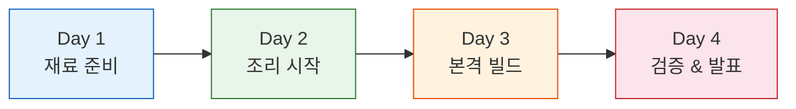
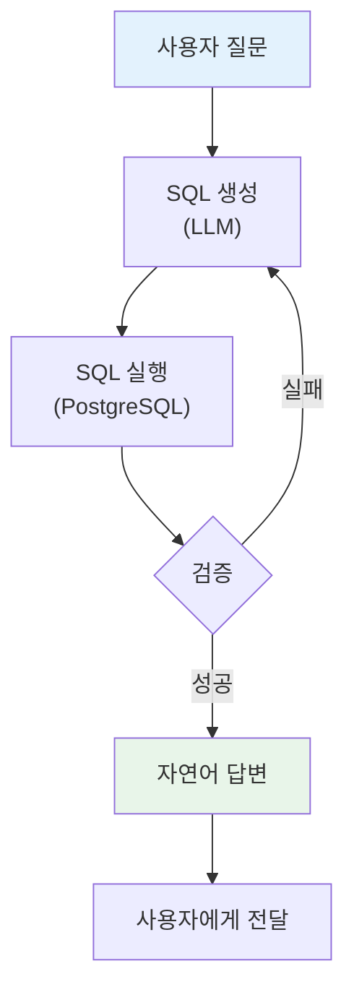

---
hide:
  - navigation
---

# AI 기반 SQL 분석 에이전트 구축

**24시간 집중 강의 (4일 과정)**

자연어로 질문하면 SQL을 생성하고, 실행하고, 검증하고, 답변하는 **AI 에이전트**를 직접 만듭니다.

[:material-rocket-launch: 시작하기](setup.md){ .md-button .md-button--primary }
[:material-book-open-variant: Day 1 바로가기](day1/index.md){ .md-button }

---

## 과정 구조

| Day | 시간 | 주제 | 키워드 |
|:---:|:---:|---|---|
| **Day 1** | 1~8H | 개관 · SQL · RAG 파이프라인 | PostgreSQL, LlamaIndex, ChromaDB, Text-to-SQL |
| **Day 2** | 9~12H | Text-to-SQL 심화 · 상담사 | 프롬프트 튜닝, 멀티턴, Gradio |
| **Day 3** | 13~20H | Vanna · LangChain · LangGraph | LCEL, Advanced RAG, SQL Agent |
| **Day 4** | 21~24H | 평가 · 모니터링 · 발표 | LangSmith, Ragas, 최종 발표 |

## 학습 여정

## 사용 기술 스택

| 카테고리 | 기술 |
|---|---|
| **데이터베이스** | PostgreSQL (Neon 클라우드) |
| **RAG 프레임워크** | LlamaIndex, ChromaDB |
| **Text-to-SQL** | Vanna.ai |
| **에이전트 프레임워크** | LangChain / LCEL, LangGraph |
| **모니터링** | LangSmith |
| **평가** | Ragas |
| **UI** | Gradio |
| **실행 환경** | Google Colab |

## 최종 산출물

4일 후 여러분은 아래와 같은 SQL 분석 에이전트를 직접 구축합니다:

---

!!! info "수업 형식"
    각 시간 = **50분 강의 + 10분 휴식** | 이론 30% · 실습 70%
    
    모든 실습은 **Google Colab**에서 진행되므로 별도 설치가 필요 없습니다.
